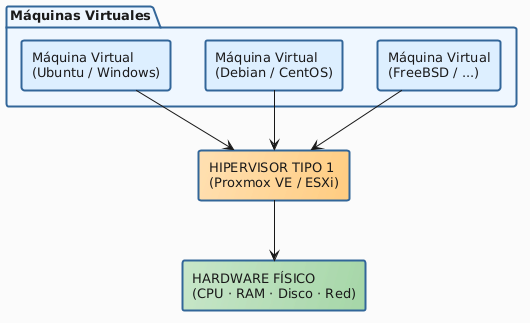
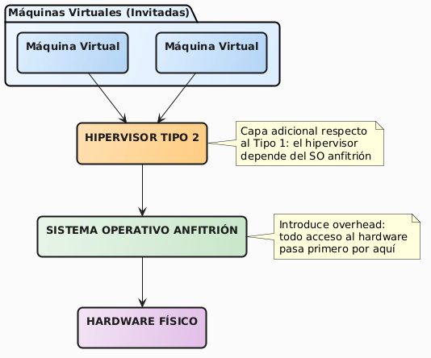

# Migración de infraestructura física a entornos virtualizados
# 5. Investigación
  

Gabriel Fernando Castillo Mendieta  
Esteban Nicolás Peña Coronado  
Luis Javier López Galindo  
Johan Sebastián Gil Salamanca  
Brayan Alejandro Cifuentes Quiroga

**Docente:** Frey Alfonso Santamaría Buitrago  
Ingeniero de Sistemas

**Universidad Pedagógica y Tecnológica de Colombia**  
Ingeniería de Sistemas y Computación  
Electiva IaaS y Virtualización  
Tunja  
2026

---

## Tabla de contenido

- [Introducción](#introducción)
- [5.1 Virtualización: fundamentos y evolución histórica](#51-virtualización-fundamentos-y-evolución-histórica)
- [5.2 Hipervisores: arquitectura y clasificación](#52-hipervisores-arquitectura-y-clasificación)
  - [5.2.1 Hipervisor de Tipo 1 (bare-metal)](#521-hipervisor-de-tipo-1-bare-metal)
  - [5.2.2 Hipervisor de Tipo 2 (hosted)](#522-hipervisor-de-tipo-2-hosted)
  - [5.2.3 Comparación de arquitecturas](#523-comparación-de-arquitecturas)
- [5.3 Proxmox VE: componentes y arquitectura interna](#53-proxmox-ve-componentes-y-arquitectura-interna)
  - [5.3.1 KVM (Kernel-based Virtual Machine)](#531-kvm-kernel-based-virtual-machine)
  - [5.3.2 QEMU como emulador de hardware](#532-qemu-como-emulador-de-hardware)
  - [5.3.3 Paravirtualización con VirtIO](#533-paravirtualización-con-virtio)
- [5.4 Oracle VirtualBox: arquitectura y características](#54-oracle-virtualbox-arquitectura-y-características)
- [5.5 Modos de red en entornos virtualizados](#55-modos-de-red-en-entornos-virtualizados)
  - [5.5.1 NAT (Network Address Translation)](#551-nat-network-address-translation)
  - [5.5.2 Adaptador puente (Bridge)](#552-adaptador-puente-bridge)
  - [5.5.3 Red interna (Internal Network)](#553-red-interna-internal-network)
  - [5.5.4 Solo-anfitrión (Host-Only)](#554-solo-anfitrión-host-only)
- [5.6 Benchmarking de infraestructura virtualizada](#56-benchmarking-de-infraestructura-virtualizada)
  - [5.6.1 Concepto de benchmark](#561-concepto-de-benchmark)
  - [5.6.2 Métricas de rendimiento relevantes](#562-métricas-de-rendimiento-relevantes)
- [5.7 Apache HTTP Server en entornos virtualizados](#57-apache-http-server-en-entornos-virtualizados)
- [5.8 PostgreSQL en entornos virtualizados](#58-postgresql-en-entornos-virtualizados)
- [5.9 Implicaciones de seguridad según el tipo de hipervisor](#59-implicaciones-de-seguridad-según-el-tipo-de-hipervisor)
- [Referencias](#referencias)

---

## Introducción

La presente sección constituye el componente investigativo del proyecto, desarrollado en correspondencia con el paso 5 de la metodología de Aprendizaje Basado en Proyectos (ABP). Su propósito es dar respuesta sistemática a los vacíos de conocimiento identificados y construir el marco teórico que fundamenta las decisiones técnicas documentadas en el informe final.

Esta investigación aborda los siguientes ejes temáticos: fundamentos de virtualización, arquitecturas de hipervisores Tipo 1 y Tipo 2, funcionamiento de Proxmox VE y Oracle VirtualBox, modelos de red en entornos virtualizados, metodología de benchmarking comparativo, y criterios estratégicos para la selección de plataformas de virtualización en distintos contextos.

---

## 5.1 Virtualización: fundamentos y evolución histórica

La virtualización es una tecnología que permite crear representaciones abstractas de recursos de cómputo (procesadores, memoria, almacenamiento y red), de manera que múltiples sistemas operativos o aplicaciones puedan ejecutarse de forma independiente y simultánea sobre un único hardware físico (Portnoy, 2012). Esta capacidad de abstracción transforma los recursos físicos en conjuntos de recursos lógicos administrables, desacoplando el software del hardware que lo ejecuta.

El concepto no es reciente. Sus orígenes se remontan a la década de 1960, cuando IBM desarrolló el sistema CP/CMS para sus mainframes de la serie 360/370, con el objetivo de permitir que múltiples usuarios compartieran simultáneamente los costosos recursos de cómputo disponibles (Creasy, 1981). No obstante, fue durante la década de 1990 cuando la virtualización comenzó a democratizarse en la arquitectura x86. VMware, fundada en 1998, resolvió los desafíos técnicos que presentaba la arquitectura x86 (originalmente no diseñada para ser virtualizada) y sentó las bases de la virtualización moderna para servidores (Smith & Nair, 2005).

En la primera década del siglo XXI, la adopción de la virtualización se aceleró en los centros de datos debido a la convergencia de varios factores: el aumento en la capacidad de los procesadores multinúcleo, la incorporación de extensiones de virtualización por hardware en arquitecturas de Intel (VT-x) y AMD (AMD-V), y la madurez de proyectos de código abierto como KVM y Xen (Laureano & Maziero, 2008). Actualmente, la virtualización es una base fundamental para tecnologías como la computación en la nube, la infraestructura como servicio (IaaS) y los centros de datos modernos.

Los beneficios que impulsan su adopción en entornos empresariales son diversos. En primer lugar, la consolidación de servidores permite ejecutar múltiples cargas de trabajo en un mismo equipo físico, lo que mejora el aprovechamiento de los recursos y reduce costos de hardware, energía y espacio (Portnoy, 2012). En segundo lugar, el aislamiento entre máquinas virtuales asegura que fallos o problemas de seguridad en una de ellas no afecten a las demás. Finalmente, herramientas de gestión como las instantáneas (snapshots), la clonación, la migración en caliente y la alta disponibilidad brindan una flexibilidad operativa difícil de alcanzar con servidores físicos tradicionales.

---

## 5.2 Hipervisores: arquitectura y clasificación

El componente de software que hace posible la virtualización es el hipervisor, también conocido como Virtual Machine Monitor (VMM). Su función es actuar como intermediario entre el hardware físico y las máquinas virtuales, gestionando el acceso a los recursos del sistema de forma controlada y aislada (Popek & Goldberg, 1974).

La clasificación más utilizada en la literatura fue propuesta por Goldberg (1972), quien distingue dos tipos arquitectónicos fundamentales.

### 5.2.1 Hipervisor de Tipo 1 (bare-metal)

Un hipervisor de Tipo 1 se instala y ejecuta **directamente sobre el hardware físico**, sin la intermediación de un sistema operativo anfitrión. Actúa él mismo como un sistema operativo minimalista cuya función principal es gestionar las máquinas virtuales y arbitrar el acceso de estas al hardware subyacente (Tanenbaum & Bos, 2015).

Ejemplos representativos incluyen VMware ESXi, Microsoft Hyper-V (en su modalidad bare-metal), Citrix Hypervisor (antes XenServer) y **Proxmox VE**. La arquitectura se ilustra en el siguiente esquema:

**Figura 1.** Arquitectura basica Hipervisor Tipo 1.

Las ventajas principales de este modelo son su menor latencia en el acceso al hardware (al eliminar la capa del SO anfitrión), su mayor eficiencia en la gestión de recursos y su superficie de ataque reducida desde el punto de vista de la seguridad (Laureano & Maziero, 2008).

### 5.2.2 Hipervisor de Tipo 2 (hosted)

Un hipervisor de Tipo 2 se instala como una **aplicación sobre un sistema operativo anfitrión** preexistente (Windows, Linux, macOS). Las máquinas virtuales se ejecutan como procesos dentro de dicho sistema operativo, que actúa como intermediario entre el hipervisor y el hardware (Tanenbaum & Bos, 2015).

Ejemplos representativos incluyen **Oracle VirtualBox**, VMware Workstation/Fusion y QEMU en su modalidad sin aceleración KVM.

**Figura 2.** Arquitectura basica Hipervisor Tipo 2.

La principal desventaja es la capa adicional introducida por el sistema operativo anfitrión, que genera un *overhead* de rendimiento. No obstante, los hipervisores Tipo 2 son más fáciles de instalar, configurar y usar en estaciones de trabajo de desarrollo, lo que los hace idóneos para entornos de laboratorio, pruebas y desarrollo (Portnoy, 2012).

### 5.2.3 Comparación de arquitecturas
**Tabla 1.** Comparacion entre hipervisores tipo 1 y tipo 2.
| Aspecto | Tipo 1 (Proxmox VE) | Tipo 2 (VirtualBox) |
|---------|---------------------|---------------------|
| **Instalación** | Bare-metal, ocupa el disco completo | Sobre SO anfitrión existente |
| **Overhead** | Mínimo (acceso directo al HW) | Mayor (capa del SO anfitrión) |
| **Rendimiento esperado** | Superior en producción | Inferior, variable según carga del SO anfitrión |
| **Facilidad de uso** | Interfaz web; curva de aprendizaje mayor | GUI intuitiva; más accesible |
| **Caso de uso típico** | Producción, centros de datos, IaaS | Desarrollo, laboratorio, pruebas locales |
| **Ejemplos** | ESXi, Hyper-V, Proxmox, Xen | VirtualBox, VMware Workstation, Parallels |
| **Licencia** | Frecuentemente comercial o open-source enterprise | Frecuentemente gratuito para uso personal |

---

## 5.3 Proxmox VE: componentes y arquitectura interna

Proxmox Virtual Environment (Proxmox VE) es una plataforma de virtualización empresarial de código abierto basada en Debian GNU/Linux, desarrollada por Proxmox Server Solutions GmbH y publicada bajo licencia GNU AGPL v3 (Proxmox Server Solutions, 2024). Integra en un único paquete dos tecnologías de virtualización complementarias: KVM para máquinas virtuales completas y LXC (Linux Containers) para contenedores del sistema. Para el presente proyecto se utilizó Proxmox VE en su versión 9.1.

### 5.3.1 KVM (Kernel-based Virtual Machine)

KVM es un módulo del kernel de Linux que convierte al propio kernel en un hipervisor de Tipo 1. Fue integrado al kernel Linux mainline a partir de la versión 2.6.20 (enero de 2007) y desde entonces constituye la base de virtualización de la mayor parte de la infraestructura en la nube pública (incluyendo AWS, Google Cloud y OpenStack) (Kivity et al., 2007).

KVM aprovecha las extensiones de virtualización por hardware presentes en los procesadores modernos: **Intel VT-x** (Virtualization Technology) y **AMD-V** (AMD Virtualization). Estas extensiones introducen un nuevo modo de operación del procesador denominado *VMX root* (en Intel), desde el cual el hipervisor puede interceptar y gestionar las instrucciones privilegiadas emitidas por los sistemas operativos invitados sin incurrir en el costoso proceso de *trap-and-emulate* que caracterizaba a las implementaciones de software puro (Adams & Agesen, 2006).

Desde la perspectiva del sistema operativo invitado, KVM expone una CPU virtual (vCPU) que ejecuta instrucciones directamente en el hardware físico en modo no privilegiado. Las instrucciones que requieren acceso a recursos privilegiados son interceptadas por KVM, que las gestiona o las pasa al hardware de forma segura.

### 5.3.2 QEMU como emulador de hardware

KVM por sí solo gestiona la CPU y la memoria, pero no emula el hardware periférico (controladores de disco, tarjetas de red, etc.). Para esta función, Proxmox combina KVM con **QEMU** (Quick Emulator), un emulador de hardware completo de código abierto (Bartholomew, 2006).

La combinación KVM+QEMU resulta en un sistema donde la CPU virtual se ejecuta de forma casi nativa (gracias a KVM) mientras que el hardware periférico es emulado o paravirtualizado por QEMU. Esta arquitectura es la que permite a Proxmox ofrecer VMs con rendimiento cercano al de hardware físico para cargas de trabajo de CPU intensivas.

### 5.3.3 Paravirtualización con VirtIO

Un aspecto técnico relevante para comprender el rendimiento de la MV de Proxmox en este proyecto es el uso de **VirtIO**, un estándar de virtualización para dispositivos de E/S que permite a los sistemas operativos invitados comunicarse directamente con el hipervisor mediante una API optimizada, en lugar de emular hardware físico completo (Russell, 2008).

- **Disco VirtIO SCSI**: controlador de almacenamiento paravirtualizado, más eficiente que la emulación de un controlador SCSI físico convencional.
- **Red VirtIO (paravirtualized)**: interfaz de red paravirtualizada, con menor latencia que la emulación de una tarjeta Intel E1000.

La paravirtualización reduce el overhead de las operaciones de I/O al eliminar la capa de emulación de hardware, permitiendo que el SO invitado utilice *drivers* especializados que conocen que están siendo virtualizados y se comunican de forma más eficiente con el hipervisor (Russell, 2008).

---

## 5.4 Oracle VirtualBox: arquitectura y características

Oracle VirtualBox es un hipervisor de Tipo 2 de código abierto (GPLv2) mantenido por Oracle Corporation. Originalmente desarrollado por Innotek GmbH, fue adquirido por Sun Microsystems en 2008 y posteriormente por Oracle en 2010 (Oracle Corporation, 2024).

VirtualBox opera como una aplicación de espacio de usuario sobre el sistema operativo anfitrión. Para gestionar el acceso al hardware, instala un driver del kernel (`vboxdrv`) que actúa como puente entre la aplicación de VirtualBox y los recursos del hardware. Este driver es el que permite a VirtualBox aprovechar las extensiones Intel VT-x/AMD-V para ejecutar código de las VMs directamente en hardware, reduciendo el overhead en operaciones de CPU intensivas.

Una característica diferenciadora de VirtualBox respecto a otros hipervisores Tipo 2 es su portabilidad multiplataforma: puede ejecutarse sobre Windows, Linux, macOS y Solaris, lo que lo hace especialmente útil en entornos heterogéneos de desarrollo.

---

## 5.5 Modos de red en entornos virtualizados

La configuración de red es uno de los aspectos más críticos en el diseño de infraestructuras virtualizadas. Tanto VirtualBox como Proxmox ofrecen múltiples modos de red, cada uno con implicaciones distintas en cuanto a conectividad, aislamiento y rendimiento (Oracle Corporation, 2024; Proxmox Server Solutions, 2024).

### 5.5.1 NAT (Network Address Translation)

En el modo NAT, el hipervisor actúa como un router con traducción de direcciones. La VM obtiene una dirección IP privada en una subred gestionada exclusivamente por el hipervisor (típicamente `10.0.2.x` en VirtualBox). El tráfico saliente de la VM es mascarado por la IP del equipo anfitrión, permitiéndole acceder a Internet y a la red externa.

La limitación principal de NAT es que **las VMs no son accesibles desde el exterior** sin configurar redirección de puertos (*port forwarding*) explícita, y tampoco pueden comunicarse directamente entre sí cuando están en distintas instancias NAT. Por esta razón, NAT es adecuado para acceso a Internet desde una VM pero no para comunicación inter-VM.

### 5.5.2 Adaptador puente (Bridge)

En el modo Bridge, el hipervisor conecta la interfaz de red virtual de la VM directamente al switch virtual que interconecta el hardware físico de la red. Desde la perspectiva de la red, la VM aparece como un nodo independiente con su propia dirección MAC y puede recibir una IP directamente del servidor DHCP de la red física.

Este modo opera a **nivel de capa 2 (Ethernet)** del modelo OSI. El hipervisor crea un bridge de software que une la interfaz física del equipo anfitrión con las interfaces virtuales de las VMs. El resultado es que la VM participa en la misma red que el equipo anfitrión, con acceso total a otros nodos de la red local.

El modo Bridge es el que se utilizó en este proyecto para lograr la comunicación entre las VMs de Proxmox y VirtualBox, y constituye la respuesta técnica al problema de conectividad entre hipervisores distintos (ver sección 5.6).

### 5.5.3 Red interna (Internal Network)

La red interna crea un segmento de red aislado que solo existe dentro del hipervisor. Las VMs conectadas a la misma red interna pueden comunicarse entre sí, pero no tienen acceso al equipo anfitrión ni a la red exterior. Es útil para simular redes privadas completamente aisladas, aunque requiere configuración manual de IP (no hay DHCP por defecto).

### 5.5.4 Solo-anfitrión (Host-Only)

El modo Host-Only crea una red virtual entre el equipo anfitrión y sus VMs. Las VMs pueden comunicarse entre sí y con el anfitrión, pero no tienen acceso a la red externa. VirtualBox crea una interfaz virtual en el anfitrión que actúa como gateway de esta red privada. Es frecuentemente utilizado para acceso SSH a VMs desde el equipo de desarrollo sin exponerlas a la red corporativa.

---

## 5.6 Benchmarking de infraestructura virtualizada

### 5.6.1 Concepto de benchmark

Un *benchmark* es un procedimiento de evaluación estandarizado que mide el rendimiento de un sistema bajo condiciones controladas y reproducibles, con el propósito de comparar dicho rendimiento contra un punto de referencia o contra sistemas alternativos (Gray, 1993). En el contexto de la infraestructura virtualizada, los benchmarks permiten cuantificar el impacto del hipervisor sobre el rendimiento de las cargas de trabajo, aislando las variables del entorno.

Un principio fundamental del benchmarking comparativo es la **equivalencia de condiciones**: para que la comparación sea válida, las VMs evaluadas deben tener configuraciones equivalentes de vCPU, RAM, sistema operativo y versiones de software. 

### 5.6.2 Métricas de rendimiento relevantes

Las métricas seleccionadas para este proyecto cubren los tres subsistemas que más frecuentemente constituyen cuellos de botella en cargas de trabajo de servidor:

**Rendimiento de CPU:**
- *Tiempo de ejecución* (segundos): tiempo total para completar una operación intensiva de CPU.
- *Throughput* (operaciones/segundo): número de operaciones completadas por unidad de tiempo.
- Las pruebas de PostgreSQL (sort, agregaciones, join, funciones matemáticas) ejercen principalmente la CPU.

**Rendimiento de I/O de disco:**
- *IOPS (Input/Output Operations Per Second)*: número de operaciones de lectura/escritura por segundo.
- *Throughput de disco* (MB/s): volumen de datos transferidos por unidad de tiempo.
- *Latencia de I/O* (ms): tiempo desde que se solicita una operación hasta que se completa.
- Las pruebas de INSERT masivo y lectura de PostgreSQL ejercen principalmente el subsistema de almacenamiento.

**Rendimiento de red y servidor web:**
- *RPS (Requests Per Second)*: número de peticiones HTTP atendidas por segundo. Es la métrica principal de capacidad de un servidor web.
- *Latencia de respuesta* (ms): tiempo transcurrido desde que el cliente envía la petición hasta que recibe la respuesta completa.
- *Tasa de error*: porcentaje de peticiones que no reciben respuesta exitosa (HTTP 200).

## 5.7 Apache HTTP Server en entornos virtualizados

Apache HTTP Server es el servidor web de código abierto más ampliamente desplegado en el mundo desde 1996 (Netcraft, 2024). Es mantenido por la Apache Software Foundation y publicado bajo la licencia Apache 2.0. Su arquitectura modular permite extender sus capacidades mediante módulos cargables dinámicamente (DSO - Dynamic Shared Objects).

En entornos virtualizados, Apache se comporta de manera similar a como lo hace en hardware físico, con la diferencia de que el rendimiento de red y de I/O depende de la capa de virtualización. Los aspectos de Apache más relevantes para el benchmark son:

- **Modelo de procesamiento (MPM):** Apache utiliza por defecto en Ubuntu el módulo `event`, que gestiona las conexiones mediante un modelo de hilos y eventos asíncronos, permitiendo atender eficientemente múltiples conexiones concurrentes con un número limitado de hilos.
- **Archivos estáticos:** El servicio de archivos estáticos (como la página de bienvenida utilizada en el benchmark) depende principalmente de las capacidades de I/O del sistema de archivos subyacente y de la velocidad de la interfaz de red virtualizada.

---

## 5.8 PostgreSQL en entornos virtualizados

PostgreSQL es un sistema de gestión de bases de datos objeto-relacional (ORDBMS) de código abierto, reconocido por su robustez, extensibilidad y cumplimiento de los estándares ACID (Atomicidad, Consistencia, Aislamiento, Durabilidad) (PostgreSQL Global Development Group, 2024).

En entornos virtualizados, el rendimiento de PostgreSQL está fuertemente condicionado por dos subsistemas del hipervisor:

**Subsistema de almacenamiento:** PostgreSQL es intensivo en I/O de disco, especialmente en operaciones de escritura que involucran el mecanismo Write-Ahead Logging (WAL). La latencia de escritura en disco es el factor limitante principal para operaciones de INSERT masivo y UPDATE. En el benchmark del proyecto, la diferencia de +280% en tiempos de INSERT entre la VM de Proxmox (HDD) y la de VirtualBox (SSD) ilustra dramáticamente este impacto.

**Subsistema de CPU:** Las operaciones de ordenamiento (ORDER BY), agregación estadística (AVG, STDDEV, percentiles) y joins analíticos consumen CPU de forma intensiva. La diferencia en rendimiento de CPU entre generaciones de procesadores (i5-3470 de 2013 vs. i5-12450H de 2022) introduce un factor de variación que va más allá de las diferencias entre hipervisores.

PostgreSQL expone dos archivos de configuración relevantes para el acceso remoto en este proyecto:
- `postgresql.conf`: controla los parámetros operativos del servidor, incluyendo `listen_addresses` que determina en qué interfaces de red acepta conexiones.
- `pg_hba.conf` (Host-Based Authentication): define las reglas de autenticación por dirección IP de origen, método de autenticación y base de datos. La entrada `host all all 192.168.137.0/24 scram-sha-256` permite conexiones autenticadas desde cualquier equipo del segmento de red del proyecto.

---

## 5.9 Implicaciones de seguridad según el tipo de hipervisor

El tipo de hipervisor tiene implicaciones directas sobre la seguridad de la infraestructura virtualizada, un aspecto que debe considerarse en la selección de plataforma para la empresa ACME.

**Aislamiento entre VMs:** Ambos tipos de hipervisor garantizan aislamiento entre las VMs mediante el mecanismo de virtualización del hardware (Intel VT-x/AMD-V). Sin embargo, la *superficie de ataque* difiere: un hipervisor Tipo 1 tiene menos código ejecutándose en el sistema (no hay SO anfitrión), lo que reduce los vectores de ataque potenciales (Laureano & Maziero, 2008). Un hipervisor Tipo 2 hereda todas las vulnerabilidades del SO anfitrión: si el SO es comprometido, todas las VMs están en riesgo.

**VM Escape:** El ataque más crítico en entornos virtualizados es el *VM Escape*, mediante el cual un atacante que comprometió una VM logra ejecutar código en el hipervisor o en el sistema anfitrión, obteniendo acceso a todas las demás VMs. Este tipo de ataque ha sido documentado en vulnerabilidades como CVE-2019-5544 (ESXi) y múltiples CVEs en VirtualBox. Los hipervisores Tipo 1 de grado empresarial (ESXi, Proxmox) tienen historiales más extensos de auditoría de seguridad y ciclos de parche más rápidos que los Tipo 2.

**Gestión de acceso:** Proxmox VE dispone de un sistema de control de acceso basado en roles (RBAC) que permite definir granularmente los permisos de usuarios sobre recursos específicos (nodos, VMs, almacenamiento). VirtualBox, orientado a uso individual, no dispone de un sistema de gestión de acceso equivalente, lo que lo hace menos adecuado en entornos multi-usuario de producción.

---

## Referencias

Adams, K., & Agesen, O. (2006). A comparison of software and hardware techniques for x86 virtualization. *ACM SIGPLAN Notices, 41*(11), 2–13. https://doi.org/10.1145/1168857.1168860

Bartholomew, D. (2006). QEMU: A multihost, multitarget emulator. *Linux Journal, 2006*(145), 2.

Blackburn, S. M., Diwan, A., Hauswirth, M., Sweeney, P. F., Amaral, J. N., Brecht, T., ... & Wiedermann, B. (2016). The truth, the whole truth, and nothing but the truth: A pragmatic guide to assessing empirical evaluations. *ACM Transactions on Programming Languages and Systems, 38*(4), 15. https://doi.org/10.1145/2983574

Creasy, R. J. (1981). The origin of the VM/370 time-sharing system. *IBM Journal of Research and Development, 25*(5), 483–490. https://doi.org/10.1147/rd.255.0483

Goldberg, R. P. (1972). Architectural principles for virtual computer systems [Doctoral dissertation, Harvard University].

Gray, J. (Ed.). (1993). *The benchmark handbook: For database and transaction processing systems* (2nd ed.). Morgan Kaufmann.

Kivity, A., Kamay, Y., Laor, D., Lublin, U., & Liguori, A. (2007). KVM: The Linux virtual machine monitor. *Proceedings of the Linux Symposium, 1*, 225–230.

Laureano, M., & Maziero, C. (2008). Virtualização: Conceitos e aplicações em segurança. *VIII Simpósio Brasileiro em Segurança da Informação e de Sistemas Computacionais (SBSeg)*, 1–50.

Netcraft. (2024). *Web server survey*. https://www.netcraft.com/blog/

Oracle Corporation. (2024). *Oracle VM VirtualBox user manual* (version 7.x). https://www.virtualbox.org/manual/

Popek, G. J., & Goldberg, R. P. (1974). Formal requirements for virtualizable third generation architectures. *Communications of the ACM, 17*(7), 412–421. https://doi.org/10.1145/361011.361073

Portnoy, M. (2012). *Virtualization essentials*. Sybex/Wiley.

PostgreSQL Global Development Group. (2024). *PostgreSQL 16 documentation*. https://www.postgresql.org/docs/16/

Proxmox Server Solutions GmbH. (2024). *Proxmox VE administration guide* (version 8.x). https://pve.proxmox.com/pve-docs/

Russell, R. (2008). virtio: Towards a de-facto standard for virtual I/O devices. *ACM SIGOPS Operating Systems Review, 42*(5), 95–103. https://doi.org/10.1145/1400097.1400108

Smith, J. E., & Nair, R. (2005). The architecture of virtual machines. *IEEE Computer, 38*(5), 32–38. https://doi.org/10.1109/MC.2005.173

Tanenbaum, A. S., & Bos, H. (2015). *Modern operating systems* (4th ed.). Pearson Education.

Tanenbaum, A. S., & Wetherall, D. J. (2011). *Computer networks* (5th ed.). Pearson Education.