<div align="center">

# PROXMOX

### Informe Técnico RED DE 3 MÁQUINAS VIRTUALES

Gabriel Fernando Castillo Mendieta  
Esteban Nicolás Peña Coronado  
Luis Javier López Galindo  
Johan Sebastián Gil Salamanca  
Brayan Alejandro Cifuentes Quiroga

**Docente:** Frey Alfonso Santamaría Buitrago  
Ingeniero de Sistemas

**Universidad Pedagógica y Tecnológica de Colombia**  
Ingeniería de Sistemas y Computación  
Electiva IaaS y Virtualización  
Tunja  
2026

</div>

---

## Tabla de contenido

- [Listado de figuras](#listado-de-figuras)
- [Listado de tablas](#listado-de-tablas)
- [1. Introducción](#1-introducción)
- [2. Objetivos](#2-objetivos)
- [3. Arquitectura del sistema](#3-arquitectura-del-sistema)
- [4. Características de los equipos anfitriones](#4-características-de-los-equipos-anfitriones)
- [5. Instalación y configuración de Proxmox VE (Hipervisor Tipo 1)](#5-instalación-y-configuración-de-proxmox-ve-hipervisor-tipo-1)
  - [5.1. Preparación del equipo y arranque desde USB](#51-preparación-del-equipo-y-arranque-desde-usb)
  - [5.2. Proceso de instalación de Proxmox VE](#52-proceso-de-instalación-de-proxmox-ve)
  - [5.3. Configuración de red de Proxmox](#53-configuración-de-red-de-proxmox)
  - [5.4. Acceso a la interfaz web de Proxmox](#54-acceso-a-la-interfaz-web-de-proxmox)
- [6. Creación de la máquina virtual en Proxmox (Servidor Web y BD)](#6-creación-de-la-máquina-virtual-en-proxmox-servidor-web-y-bd)
  - [6.1. Configuración general de la MV](#61-configuración-general-de-la-mv)
  - [6.2. Selección del sistema operativo](#62-selección-del-sistema-operativo)
  - [6.3. Configuración de sistema](#63-configuración-de-sistema)
  - [6.4. Configuración de CPU](#64-configuración-de-cpu)
  - [6.5. Configuración de memoria RAM](#65-configuración-de-memoria-ram)
  - [6.6. Configuración de disco](#66-configuración-de-disco)
  - [6.7. Configuración de red](#67-configuración-de-red)
  - [6.8. Resumen y confirmación](#68-resumen-y-confirmación)
  - [6.9. Instalación de Ubuntu Server y credenciales](#69-instalación-de-ubuntu-server-y-credenciales)
  - [6.10. Resumen de hardware de la MV en Proxmox](#610-resumen-de-hardware-de-la-mv-en-proxmox)
- [7. Instalación de servicios en la MV de Proxmox](#7-instalación-de-servicios-en-la-mv-de-proxmox)
  - [7.1. Instalación y ejecución de Apache](#71-instalación-y-ejecución-de-apache)
  - [7.2. Instalación y ejecución de PostgreSQL](#72-instalación-y-ejecución-de-postgresql)
- [8. Creación de la máquina virtual en Oracle VirtualBox (Hipervisor Tipo 2)](#8-creación-de-la-máquina-virtual-en-oracle-virtualbox-hipervisor-tipo-2)
  - [8.1. Selección del sistema operativo e imagen ISO](#81-selección-del-sistema-operativo-e-imagen-iso)
  - [8.2. Proceso de instalación de Ubuntu Server](#82-proceso-de-instalación-de-ubuntu-server)
  - [8.3. Configuración de red (Adaptador puente)](#83-configuración-de-red-adaptador-puente)
  - [8.4. Configuración general de la MV en VirtualBox](#84-configuración-general-de-la-mv-en-virtualbox)
  - [8.5. Configuración de red estática con Netplan](#85-configuración-de-red-estática-con-netplan)
  - [8.6. Verificación de puertos y servicios](#86-verificación-de-puertos-y-servicios)
- [9. Instalación de servicios en la MV de VirtualBox](#9-instalación-de-servicios-en-la-mv-de-virtualbox)
  - [9.1. Instalación y verificación de PostgreSQL](#91-instalación-y-verificación-de-postgresql)
  - [9.2. Creación de base de datos y usuarios](#92-creación-de-base-de-datos-y-usuarios)
  - [9.3. Configuración de acceso remoto a PostgreSQL](#93-configuración-de-acceso-remoto-a-postgresql)
- [10. Configuración del cliente externo — Fedora Workstation (MV de desarrollo)](#10-configuración-del-cliente-externo--fedora-workstation-mv-de-desarrollo)
  - [10.1. Configuración de la MV Fedora Workstation](#101-configuración-de-la-mv-fedora-workstation)
  - [10.2. Acceso al servidor web Apache desde Fedora](#102-acceso-al-servidor-web-apache-desde-fedora)
  - [10.3. Conexión a las bases de datos con DBeaver](#103-conexión-a-las-bases-de-datos-con-dbeaver)
- [11. Pruebas de rendimiento (Benchmarks)](#11-pruebas-de-rendimiento-benchmarks)
  - [11.1. Benchmark de Apache (Servidor Web)](#111-benchmark-de-apache-servidor-web)
  - [11.2. Benchmark de PostgreSQL (Base de Datos)](#112-benchmark-de-postgresql-base-de-datos)
  - [11.3. Resultados del benchmark de Apache](#113-resultados-del-benchmark-de-apache)
  - [11.4. Resultados del benchmark de PostgreSQL](#114-resultados-del-benchmark-de-postgresql)
  - [11.5. Comparativa final de PostgreSQL](#115-comparativa-final-de-postgresql)
  - [11.6. Comparativa final de Apache](#116-comparativa-final-de-apache)
- [12. Análisis de resultados](#12-análisis-de-resultados)
- [13. Conclusiones](#13-conclusiones)

---

## Listado de figuras

| N.° | Descripción | Sección |
|-----|-------------|---------|
| Figura 1 | BIOS del equipo HP para Proxmox (Intel Core i5-3470) | 5.1 |
| Figura 2 | Pantalla de bienvenida del instalador de Proxmox VE 9.1 | 5.2 |
| Figura 3 | Configuración de red durante la instalación de Proxmox | 5.2 |
| Figura 4 | Consola de Proxmox — verificación de red con `ip a` | 5.3 |
| Figura 5 | Archivo de configuración de red `/etc/network/interfaces` | 5.3 |
| Figura 6 | Especificaciones del equipo Proxmox — Intel Core i5-3470 @ 3.20 GHz | 4 |
| Figura 7 | Especificaciones del equipo VirtualBox — Intel Core i5-12450H @ 4.40 GHz | 4 |
| Figura 8 | Consola de inicio de sesión de Proxmox VE | 5.4 |
| Figura 9 | Creación de MV — Configuración general (Nombre: ServidorWEB, ID: 100) | 6.1 |
| Figura 10 | Creación de MV — Selección de sistema operativo (Ubuntu 24.04.4 Server) | 6.2 |
| Figura 11 | Creación de MV — Configuración de sistema | 6.3 |
| Figura 12 | Creación de MV — Configuración de CPU (2 cores) | 6.4 |
| Figura 13 | Creación de MV — Configuración de memoria RAM (6144 MiB) | 6.5 |
| Figura 14 | Creación de MV — Configuración de disco (20 GiB, SCSI) | 6.6 |
| Figura 15 | Creación de MV — Configuración de red (Bridge vmbr0, VirtIO) | 6.7 |
| Figura 16 | Creación de MV — Resumen de confirmación | 6.8 |
| Figura 17 | Instalación de Ubuntu Server — Definición de credenciales en Proxmox | 6.9 |
| Figura 18 | Resumen de hardware de la MV en Proxmox | 6.10 |
| Figura 19 | Panel de resumen de la MV ServidorWEB en Proxmox | 6.10 |
| Figura 20 | Verificación de Apache en ejecución en la MV de Proxmox | 7.1 |
| Figura 21 | Verificación de PostgreSQL en ejecución en la MV de Proxmox | 7.2 |
| Figura 22 | Creación de MV en VirtualBox — Selección de imagen ISO de Ubuntu Server | 8.1 |
| Figura 23 | Proceso de instalación de Ubuntu Server en VirtualBox | 8.2 |
| Figura 24 | Configuración del adaptador puente en VirtualBox | 8.3 |
| Figura 25 | Configuración general de la MV en VirtualBox | 8.4 |
| Figura 26 | Verificación de puertos en escucha dentro de la MV de VirtualBox | 8.6 |
| Figura 27 | Instalación de PostgreSQL en la MV de VirtualBox | 9.1 |
| Figura 28 | Creación de base de datos `electiva` en VirtualBox | 9.2 |
| Figura 29 | Creación del usuario `luis` y asignación de privilegios | 9.2 |
| Figura 30 | Ejecución del benchmark de PostgreSQL — Proxmox (Tipo 1) | 11.2 |
| Figura 31 | Ejecución del benchmark de PostgreSQL — VirtualBox (Tipo 2) | 11.2 |
| Figura 32 | Comparativa final del benchmark de PostgreSQL | 11.5 |
| Figura 33 | Ejecución y comparativa del benchmark de Apache | 11.6 |
| Figura 34 | Configuración de la MV Fedora Workstation en VirtualBox | 10.1 |
| Figura 35 | Acceso al servidor Apache desde Fedora Workstation | 10.2 |
| Figura 36 | Conexión a PostgreSQL desde DBeaver en Fedora | 10.3 |
| Figura 37 | Vista de las dos bases de datos conectadas en DBeaver | 10.3 |

## Listado de tablas

| N.° | Descripción | Sección |
|-----|-------------|---------|
| Tabla 1 | Direcciones IP de los equipos y máquinas virtuales en la red interna | 3 |
| Tabla 2 | Credenciales de acceso a las máquinas virtuales | 3 |
| Tabla 3 | Credenciales de acceso a las bases de datos PostgreSQL | 3 |
| Tabla 4 | Características de los equipos anfitriones | 4 |
| Tabla 5 | Configuración de las máquinas virtuales | 6.8 |
| Tabla 6 | Resultados del benchmark de Apache | 11.3 |
| Tabla 7 | Resultados del benchmark de PostgreSQL | 11.4 |
| Tabla 8 | Comparativa final de PostgreSQL entre hipervisores | 11.5 |
| Tabla 9 | Comparativa final de Apache entre hipervisores | 11.6 |
| Tabla 10 | Aspectos del hardware anfitrión relevantes para la interpretación de los benchmarks | 12 |

---

## 1. Introducción

El presente informe técnico documenta el diseño, implementación y evaluación de una infraestructura virtualizada compuesta por tres máquinas virtuales interconectadas en red, cada una gestionada con un software de virtualización diferente. El sistema asegura la presencia de al menos un hipervisor de Tipo 1 y uno de Tipo 2 en la arquitectura.

Cada máquina virtual representa uno de los servidores críticos de la empresa ficticia **ACME**:

- **Servidor Web y Base de Datos (Tipo 1):** Máquina virtual gestionada por **Proxmox VE** (hipervisor Tipo 1), ejecutando Ubuntu Server con Apache y PostgreSQL.
- **Servidor Web y Base de Datos (Tipo 2):** Máquina virtual gestionada por **Oracle VirtualBox** (hipervisor Tipo 2), ejecutando Ubuntu Server con Apache y PostgreSQL.
- **Servidor de Desarrollo (Cliente externo):** Máquina virtual con **Fedora Workstation** gestionada por VirtualBox, que actúa como estación de trabajo para acceder a los servicios de las otras dos máquinas virtuales.

Las máquinas virtuales están configuradas para comunicarse entre sí a través de una red interna virtual, independientemente del tipo de hipervisor que las gestione.

---

## 2. Objetivos

- Instalar y configurar un hipervisor de Tipo 1 (Proxmox VE) y un hipervisor de Tipo 2 (Oracle VirtualBox).
- Crear y configurar tres máquinas virtuales interconectadas en red, representando los servidores críticos de la empresa ACME.
- Instalar y configurar servicios de servidor web (Apache) y base de datos (PostgreSQL) en las máquinas virtuales.
- Configurar la comunicación entre las tres máquinas virtuales a través de una red interna.
- Realizar pruebas de rendimiento comparativas (benchmarks) entre los dos hipervisores.
- Validar la conectividad desde un cliente externo (Fedora Workstation) hacia los servidores.

---

## 3. Arquitectura del sistema

La arquitectura implementada consiste en tres máquinas virtuales que se comunican a través de una red interna con el segmento `192.168.137.0/24`:

**Tabla 1.** Direcciones IP de los equipos y máquinas virtuales en la red interna.

| Equipo / Máquina Virtual | Hipervisor | Sistema Operativo | IP | Servicios |
|--------------------------|------------|-------------------|-----|-----------|
| Equipo Proxmox (host) | Proxmox VE 9.1 (bare-metal) | Debian (Proxmox) | 192.168.137.2 | Administración de MVs |
| ServidorWEB (MV Proxmox) | Proxmox VE (Tipo 1) | Ubuntu Server 24.04.4 | 192.168.137.7 | Apache, PostgreSQL |
| Equipo Gabriel (host) | VirtualBox (sobre Pop!_OS) | Pop!_OS 24.04 LTS | 192.168.137.3 | Host de MVs |
| ubuntu-server (MV Gabriel) | VirtualBox (Tipo 2) | Ubuntu Server 24.04.4 | 192.168.137.6 | Apache, PostgreSQL |
| Equipo Luis Javier (host) | VirtualBox | — | 192.168.137.4 / 192.168.137.5 | Host de MV Workstation |
| Fedora Workstation (MV Luis Javier) | VirtualBox (Tipo 2) | Fedora Workstation | 192.168.137.8 | Cliente (DBeaver, navegador) |

**Tabla 2.** Credenciales de acceso a las máquinas virtuales.

| Equipo | Usuario | Contraseña |
|--------|---------|------------|
| Proxmox (interfaz web) | `root` | `12345678` |
| MV Proxmox (Ubuntu Server) | `nico` | `12345678` |
| MV Gabriel (Ubuntu Server en VirtualBox) | `vboxuser` | `12345678` |
| MV Luis Javier Workstation (Fedora) | `nico` | `12345678` |

**Tabla 3.** Credenciales de acceso a las bases de datos PostgreSQL.

| Base de datos | Usuario | Contraseña | Host (IP) | Puerto |
|---------------|---------|------------|-----------|--------|
| `testing` | `nico` | `12345678` | 192.168.137.7 | 5432 |
| `electiva` | `luis` | `12345678` | 192.168.137.6 | 5432 |

---

## 4. Características de los equipos anfitriones

Para la implementación del proyecto se utilizaron dos equipos físicos con características diferentes. Es importante destacar esta diferencia ya que influye directamente en los resultados de rendimiento obtenidos.

**Tabla 4.** Características de los equipos anfitriones.

| Característica | Equipo Proxmox (Tipo 1) | Equipo VirtualBox (Tipo 2) |
|----------------|--------------------------|---------------------------|
| **Marca** | HP | Cyborg 15 A12VF |
| **Procesador** | Intel Core i5-3470 @ 3.20 GHz (3.ª generación) | Intel Core i5-12450H @ 4.40 GHz (12.ª generación) |
| **Núcleos físicos** | 4 | 12 |
| **RAM total** | ~8 GB | 38.88 GiB |
| **GPU** | Integrada | NVIDIA GeForce RTX 4060 Max-Q + Intel UHD |
| **Almacenamiento** | HDD | SSD 459.52 GiB |
| **Sistema operativo host** | Proxmox VE 9.1 (bare-metal) | Pop!_OS 24.04 LTS |
| **Año del hardware** | 2013 | 2022 |

<div align="center">

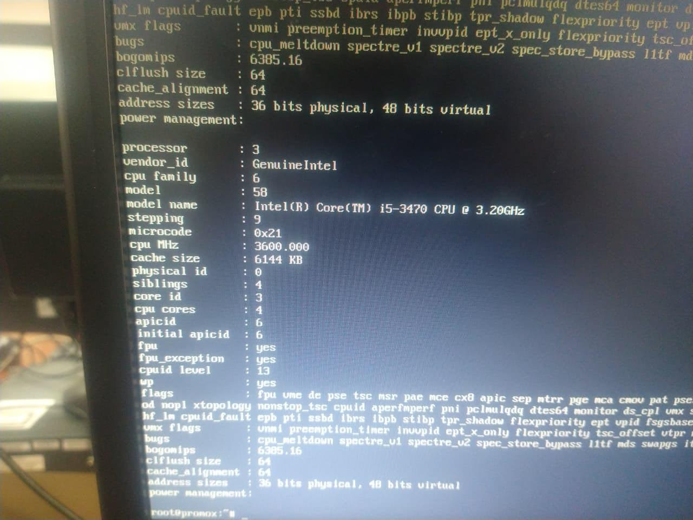

**Figura 6.** Especificaciones del equipo Proxmox — Intel Core i5-3470 @ 3.20 GHz.

</div>

<div align="center">

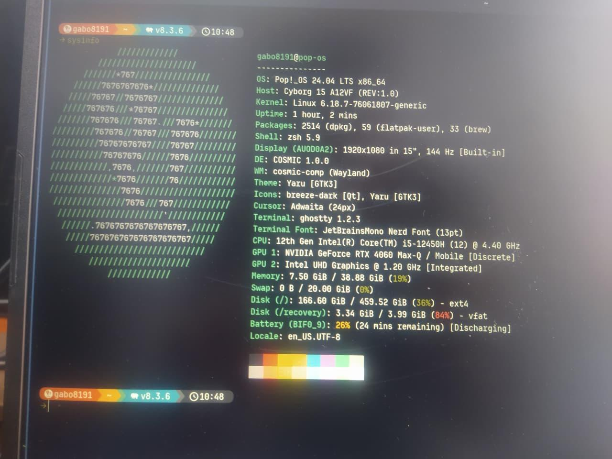

**Figura 7.** Especificaciones del equipo VirtualBox — Intel Core i5-12450H @ 4.40 GHz, 38.88 GiB RAM.

</div>

---

## 5. Instalación y configuración de Proxmox VE (Hipervisor Tipo 1)

Proxmox VE es un hipervisor de Tipo 1 (bare-metal) basado en Debian GNU/Linux que se instala directamente sobre el hardware del servidor, sin necesidad de un sistema operativo intermedio. Esto permite un acceso directo a los recursos del hardware, lo cual resulta en un rendimiento superior en la gestión de máquinas virtuales.

### 5.1. Preparación del equipo y arranque desde USB

Se preparó una memoria USB booteable con la imagen ISO de Proxmox VE 9.1. El equipo HP de la sala de cómputo fue configurado desde su BIOS para arrancar desde el dispositivo USB.

<div align="center">

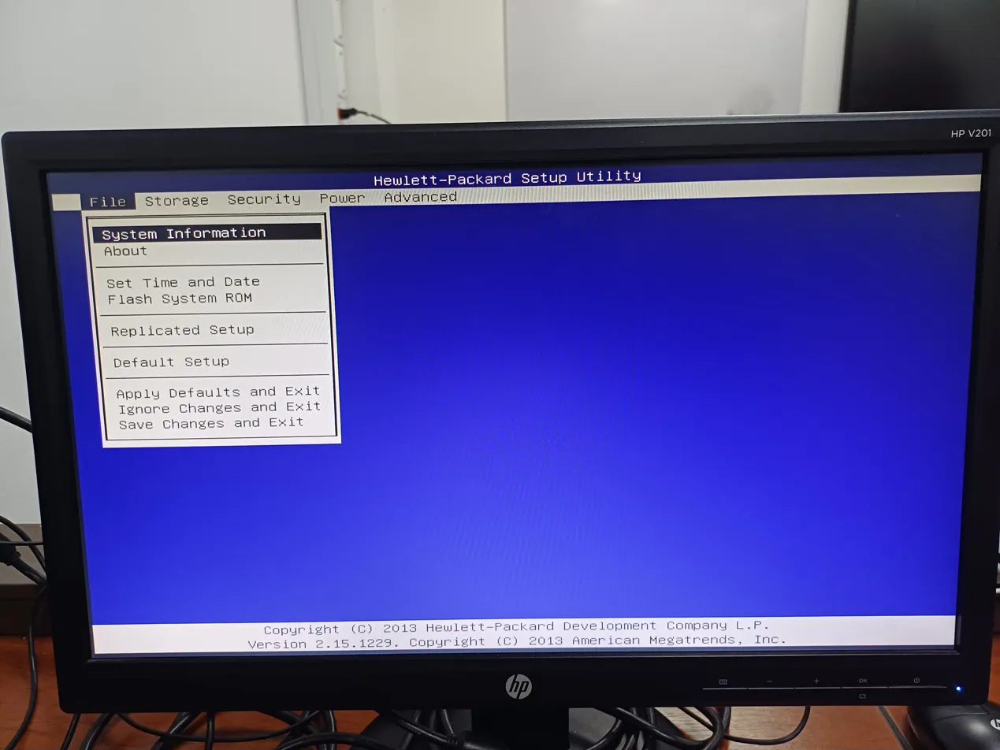

**Figura 1.** BIOS del equipo HP — Hewlett-Packard Setup Utility para configurar el arranque desde USB.

</div>

### 5.2. Proceso de instalación de Proxmox VE

Una vez el equipo arrancó desde la USB, se presentó la pantalla de bienvenida del instalador de Proxmox VE 9.1. Se seleccionó la opción **Install Proxmox VE (Graphical)** para utilizar la interfaz gráfica de instalación.

<div align="center">

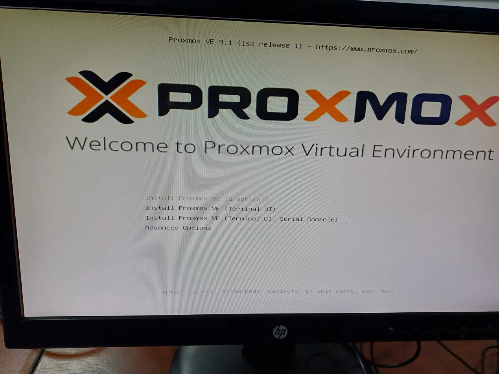

**Figura 2.** Pantalla de bienvenida del instalador de Proxmox VE 9.1.

</div>

El proceso de instalación siguió los siguientes pasos:

1. **Aceptación de licencia (EULA):** Se aceptaron los términos de la licencia.
2. **Selección del disco de instalación:** Se seleccionó el disco duro del equipo donde se instaló Proxmox. Todo el contenido previo del disco fue eliminado.
3. **Configuración de región:** Se configuró el país, zona horaria y distribución de teclado.
4. **Contraseña y correo electrónico:** Se definió la contraseña del usuario `root` y un correo de administrador.
5. **Configuración de red:** Se definieron los parámetros de red del servidor.

<div align="center">

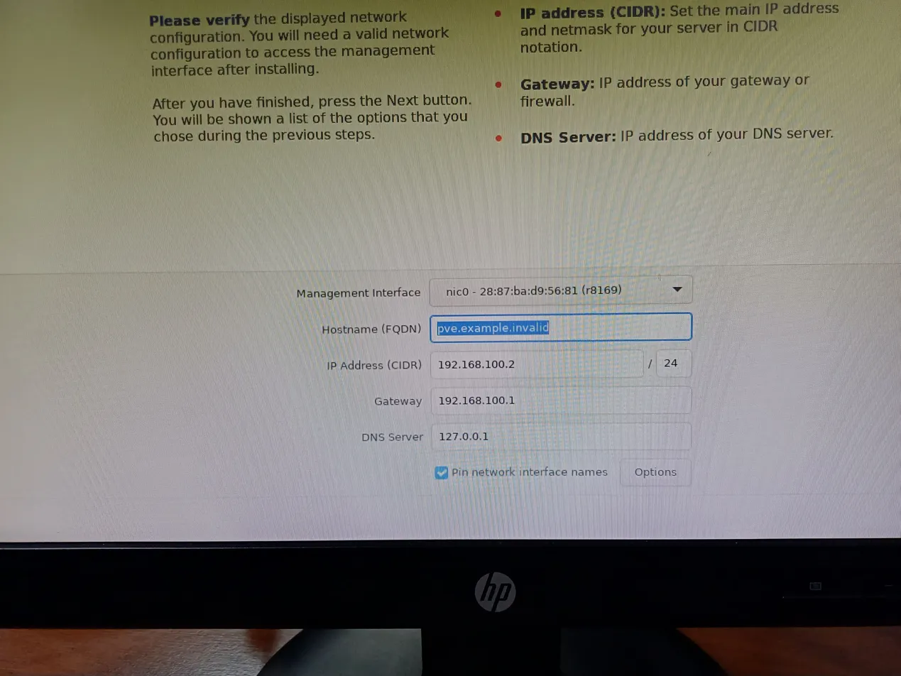

**Figura 3.** Configuración de red durante la instalación de Proxmox VE — Hostname, IP, Gateway y DNS.

</div>

Los parámetros de red configurados durante la instalación fueron:

- **Hostname (FQDN):** `proxmox.local`
- **IP Address (CIDR):** `192.168.100.2/24`
- **Gateway:** `192.168.100.1`
- **DNS Server:** `127.0.0.1`

Tras verificar el resumen de la configuración, se procedió con la instalación que tardó aproximadamente 5-10 minutos. Al finalizar, el equipo se reinició automáticamente.

### 5.3. Configuración de red de Proxmox

Una vez instalado Proxmox, se verificó la configuración de red desde la consola del servidor. Se accedió al archivo `/etc/network/interfaces` para confirmar que la configuración del bridge de red fuera correcta.

<div align="center">

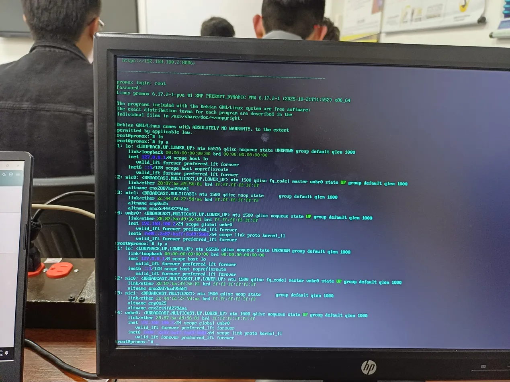

**Figura 4.** Consola de Proxmox — verificación de las interfaces de red con el comando `ip a`.

</div>

<div align="center">

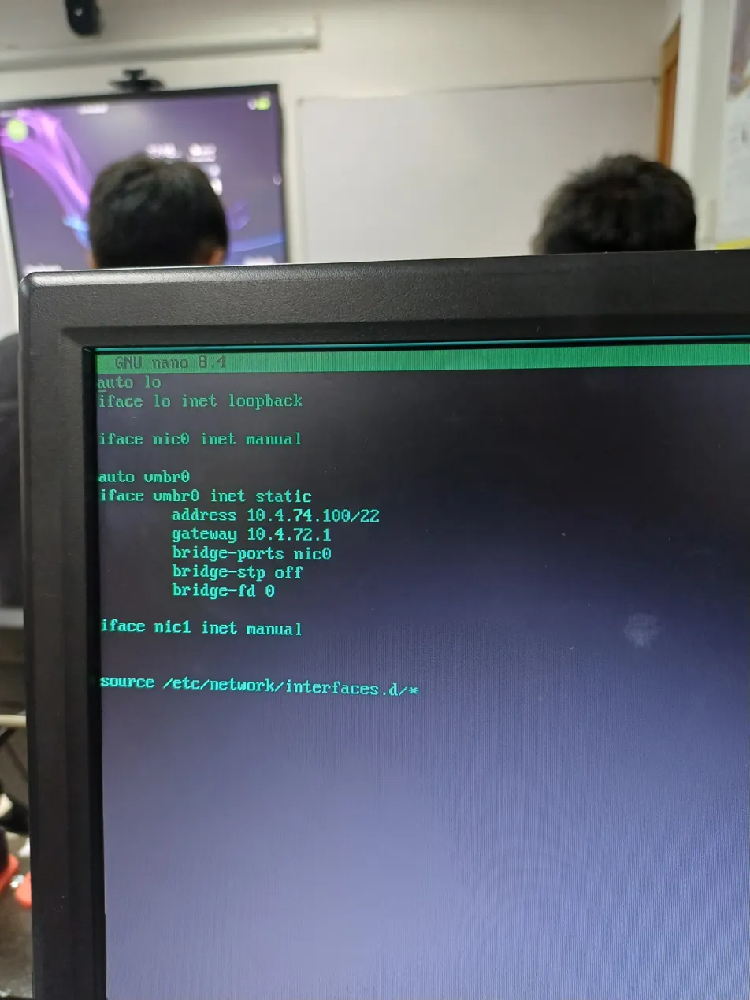

**Figura 5.** Archivo `/etc/network/interfaces` — Configuración del bridge `vmbr0` con IP estática.

</div>

La configuración final de red del servidor Proxmox quedó de la siguiente manera:

```
auto vmbr0
iface vmbr0 inet static
    address 10.4.74.100/22
    gateway 10.4.72.1
    bridge-ports nic0
    bridge-stp off
    bridge-fd 0
```

### 5.4. Acceso a la interfaz web de Proxmox

Con la instalación y configuración de red completadas, se accedió a la interfaz web de administración de Proxmox desde un navegador en otro equipo de la misma red, ingresando a la dirección:

```
https://192.168.100.2:8006
```

Las credenciales de acceso utilizadas fueron:
- **Usuario:** `root`
- **Contraseña:** `12345678`
- **Realm:** Linux PAM

<div align="center">

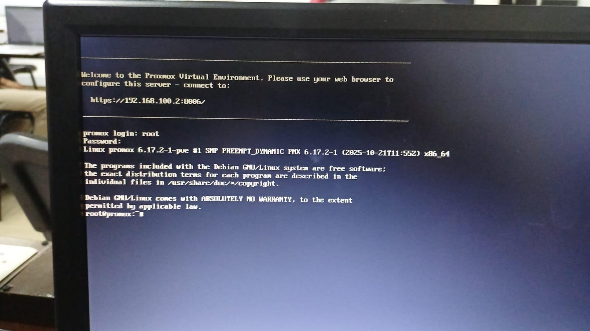

**Figura 8.** Consola del servidor Proxmox VE tras el inicio de sesión exitoso como `root`.

</div>

---

## 6. Creación de la máquina virtual en Proxmox (Servidor Web y BD)

Se procedió a crear la máquina virtual que funcionará como **servidor web y base de datos** dentro de Proxmox. Se utilizó la imagen ISO de **Ubuntu Server 24.04.4 LTS**, previamente cargada en el almacenamiento local de Proxmox.

### 6.1. Configuración general de la MV

Se asignó el nombre **ServidorWEB** con el ID de máquina virtual **100** en el nodo `proxmox`.

<div align="center">

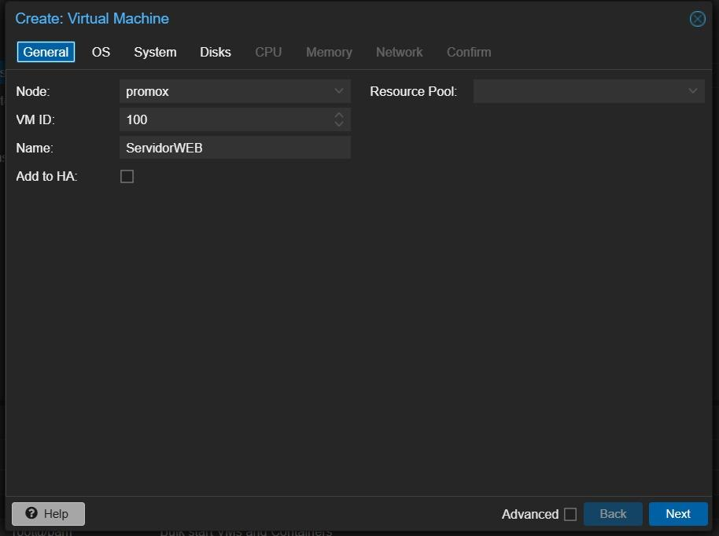

**Figura 9.** Creación de MV en Proxmox — Configuración general: Nombre `ServidorWEB`, VM ID `100`.

</div>

### 6.2. Selección del sistema operativo

Se seleccionó la imagen ISO de **Ubuntu Server 24.04.4** desde el almacenamiento local. El tipo de sistema operativo fue configurado como **Linux** con kernel **6.x - 2.6**.

<div align="center">

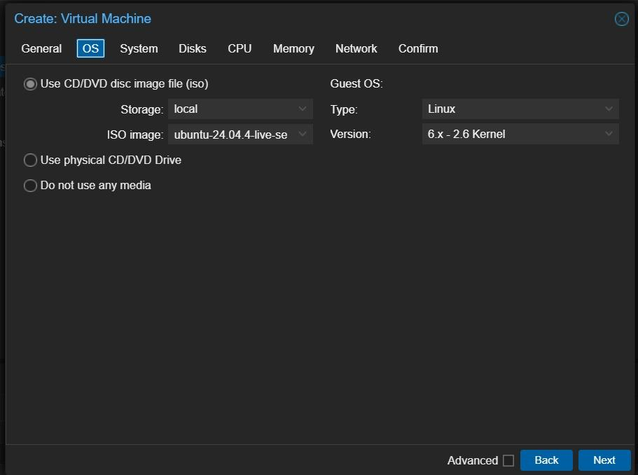

**Figura 10.** Selección del sistema operativo — Imagen ISO `ubuntu-24.04.4-live-server-amd64.iso`.

</div>

### 6.3. Configuración de sistema

Se mantuvieron los valores por defecto para la configuración del sistema: tarjeta gráfica por defecto, máquina i440fx, BIOS SeaBIOS y controlador SCSI VirtIO.

<div align="center">

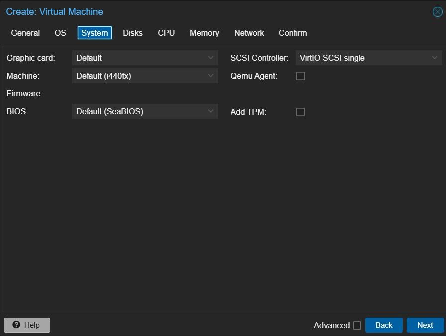

**Figura 11.** Configuración de sistema de la MV — BIOS SeaBIOS, controlador VirtIO SCSI single.

</div>

### 6.4. Configuración de CPU

Se asignaron **2 núcleos** de CPU con 1 socket, tipo de CPU `x86-64-v2-AES`, totalizando 2 cores disponibles para la máquina virtual.

<div align="center">

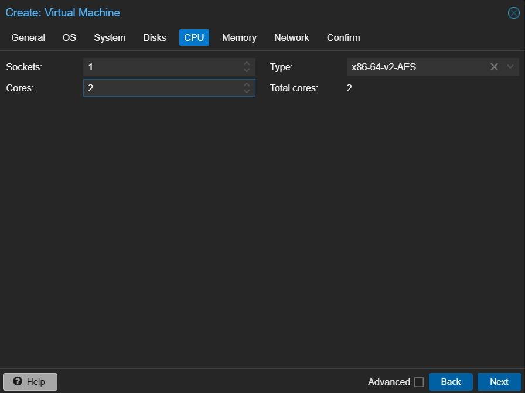

**Figura 12.** Configuración de CPU — 1 socket, 2 cores, tipo x86-64-v2-AES.

</div>

### 6.5. Configuración de memoria RAM

Se asignaron **6144 MiB (6 GB)** de memoria RAM a la máquina virtual.

<div align="center">

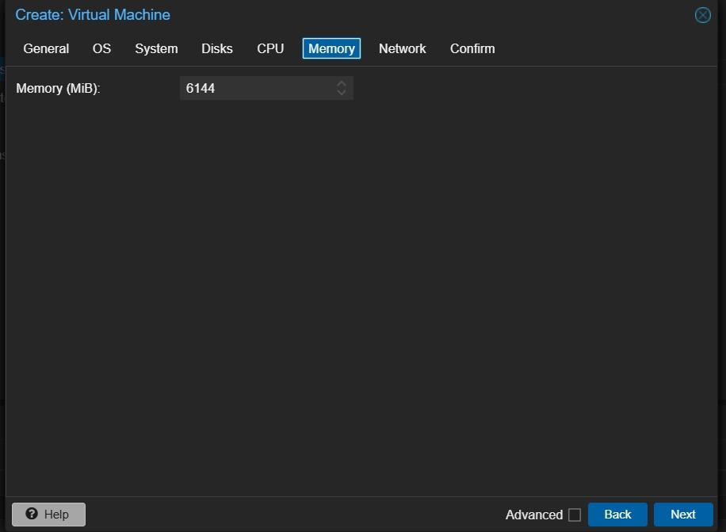

**Figura 13.** Configuración de memoria RAM — 6144 MiB asignados.

</div>

### 6.6. Configuración de disco

Se configuró un disco virtual de **20 GiB** con interfaz SCSI, almacenamiento en `local-lvm`, formato raw y habilitación de IO thread.

<div align="center">

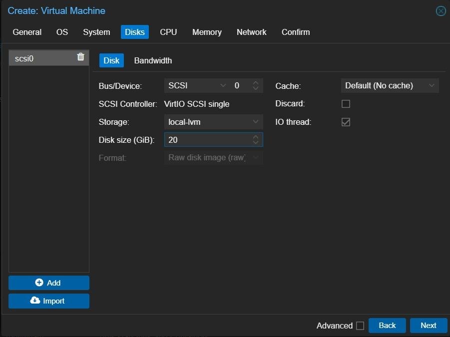

**Figura 14.** Configuración de disco — 20 GiB, SCSI, almacenamiento local-lvm, IO thread habilitado.

</div>

### 6.7. Configuración de red

Se configuró la interfaz de red utilizando el bridge `vmbr0` con el modelo **VirtIO (paravirtualized)**, sin VLAN Tag y con firewall habilitado.

<div align="center">

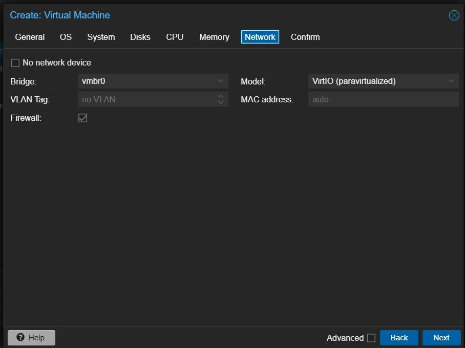

**Figura 15.** Configuración de red — Bridge vmbr0, modelo VirtIO (paravirtualized).

</div>

### 6.8. Resumen y confirmación

Antes de finalizar la creación de la máquina virtual, Proxmox presentó un resumen completo de toda la configuración seleccionada para su verificación.

<div align="center">

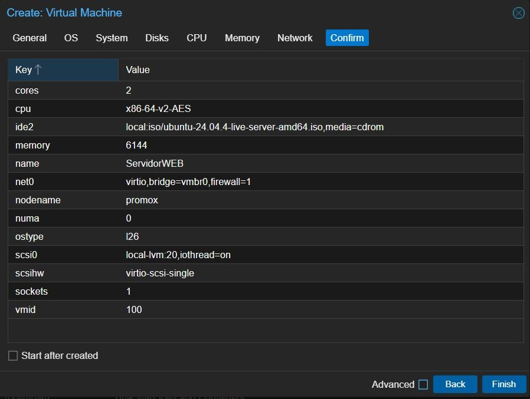

**Figura 16.** Resumen de confirmación de la MV — Todos los parámetros configurados.

</div>

**Tabla 5.** Configuración de las máquinas virtuales.

| Parámetro | Valor (Proxmox) | Valor (VirtualBox) |
|-----------|-----------------|-------------------|
| **Nombre** | ServidorWEB | ubuntu-server |
| **Sistema operativo** | Ubuntu Server 24.04.4 | Ubuntu Server 24.04.4 |
| **CPU** | 2 cores (x86-64-v2-AES) | 2 procesadores |
| **RAM** | 6144 MiB (6 GB) | 6144 MB (6 GB) |
| **Disco** | 20 GiB | 25 GB |
| **Red** | Bridge vmbr0, VirtIO | Adaptador puente, Intel PRO/1000 |
| **IP asignada** | 192.168.137.7 | 192.168.137.6 |
| **Usuario SO** | `nico` | `vboxuser` |
| **Contraseña SO** | `12345678` | `12345678` |
| **BD creada** | `testing` (usuario: `nico`) | `electiva` (usuario: `luis`) |

### 6.9. Instalación de Ubuntu Server y credenciales

Una vez creada la máquina virtual, se procedió con la instalación de Ubuntu Server. Durante el proceso de instalación se definieron las credenciales de acceso:

- **Usuario:** `nico`
- **Contraseña:** `12345678`

<div align="center">

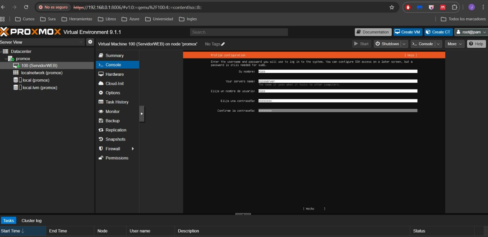

**Figura 17.** Instalación de Ubuntu Server en Proxmox — Definición de credenciales de usuario.

</div>

### 6.10. Resumen de hardware de la MV en Proxmox

Tras completar la instalación, se verificó la configuración de hardware desde la interfaz web de Proxmox.

<div align="center">

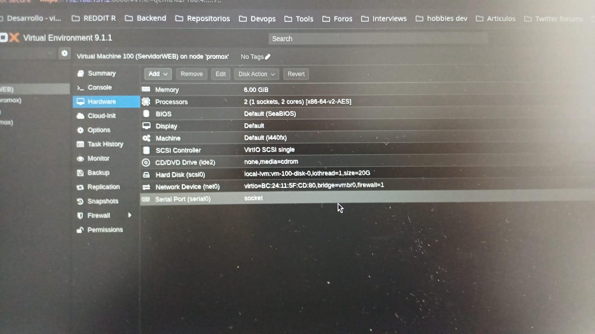

**Figura 18.** Resumen de hardware de la MV ServidorWEB en Proxmox — Memoria 6 GB, 2 cores, disco 20G.

</div>

<div align="center">

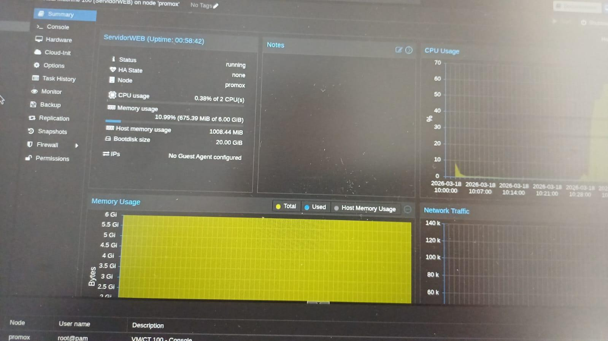

**Figura 19.** Panel de resumen de la MV ServidorWEB — Estado running, uso de CPU y memoria.

</div>

---

## 7. Instalación de servicios en la MV de Proxmox

Con la máquina virtual de Ubuntu Server ejecutándose correctamente en Proxmox, se procedió a instalar los servicios requeridos: **Apache** como servidor web y **PostgreSQL** como servidor de base de datos.

### 7.1. Instalación y ejecución de Apache

Se instaló el servidor web Apache mediante el comando:

```bash
sudo apt install apache2 -y
```

Posteriormente se verificó que el servicio se encontrara activo y en ejecución:

```bash
sudo systemctl status apache2
```

<div align="center">

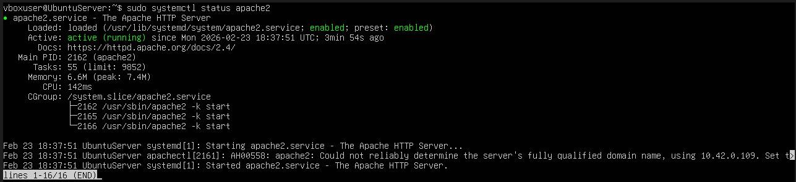

**Figura 20.** Verificación de Apache HTTP Server en ejecución en la MV de Proxmox — Estado `active (running)`.

</div>

### 7.2. Instalación y ejecución de PostgreSQL

Se instaló PostgreSQL junto con sus herramientas adicionales:

```bash
sudo apt install postgresql postgresql-contrib -y
```

Se verificó el estado del servicio:

```bash
sudo systemctl status postgresql
```

<div align="center">

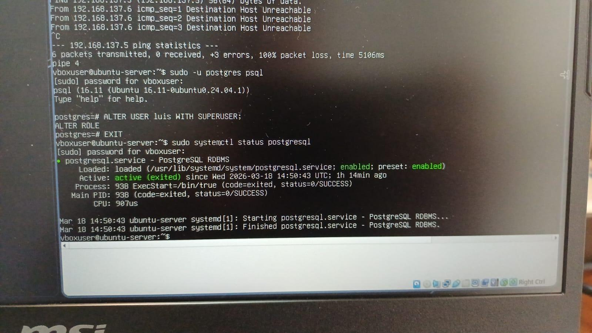

**Figura 21.** Verificación de PostgreSQL en ejecución en la MV de Proxmox — Estado `active (exited)`.

</div>

Se configuró el acceso remoto a PostgreSQL modificando dos archivos de configuración:

1. **`/etc/postgresql/16/main/postgresql.conf`:** Se cambió `listen_addresses` a `'*'` para aceptar conexiones desde cualquier interfaz.

```conf
listen_addresses = '*'
```

2. **`/etc/postgresql/16/main/pg_hba.conf`:** Se agregó la regla para permitir conexiones desde la red local.

```conf
host    all    all    192.168.137.0/24    scram-sha-256
```

3. Se reinició el servicio para aplicar los cambios:

```bash
sudo systemctl restart postgresql
```

---

## 8. Creación de la máquina virtual en Oracle VirtualBox (Hipervisor Tipo 2)

Oracle VirtualBox es un hipervisor de Tipo 2 que se ejecuta sobre un sistema operativo anfitrión (en este caso Pop!_OS 24.04 LTS). A diferencia de Proxmox, VirtualBox requiere de un sistema operativo base sobre el cual correr, lo que introduce una capa adicional de abstracción que puede afectar el rendimiento.

Se eligió **Ubuntu Server 24.04.4 LTS** como sistema operativo invitado para mantener consistencia con la MV de Proxmox y poder realizar comparaciones justas.

### 8.1. Selección del sistema operativo e imagen ISO

Se creó una nueva máquina virtual en VirtualBox seleccionando la misma imagen ISO de Ubuntu Server 24.04.4 utilizada en Proxmox.

<div align="center">

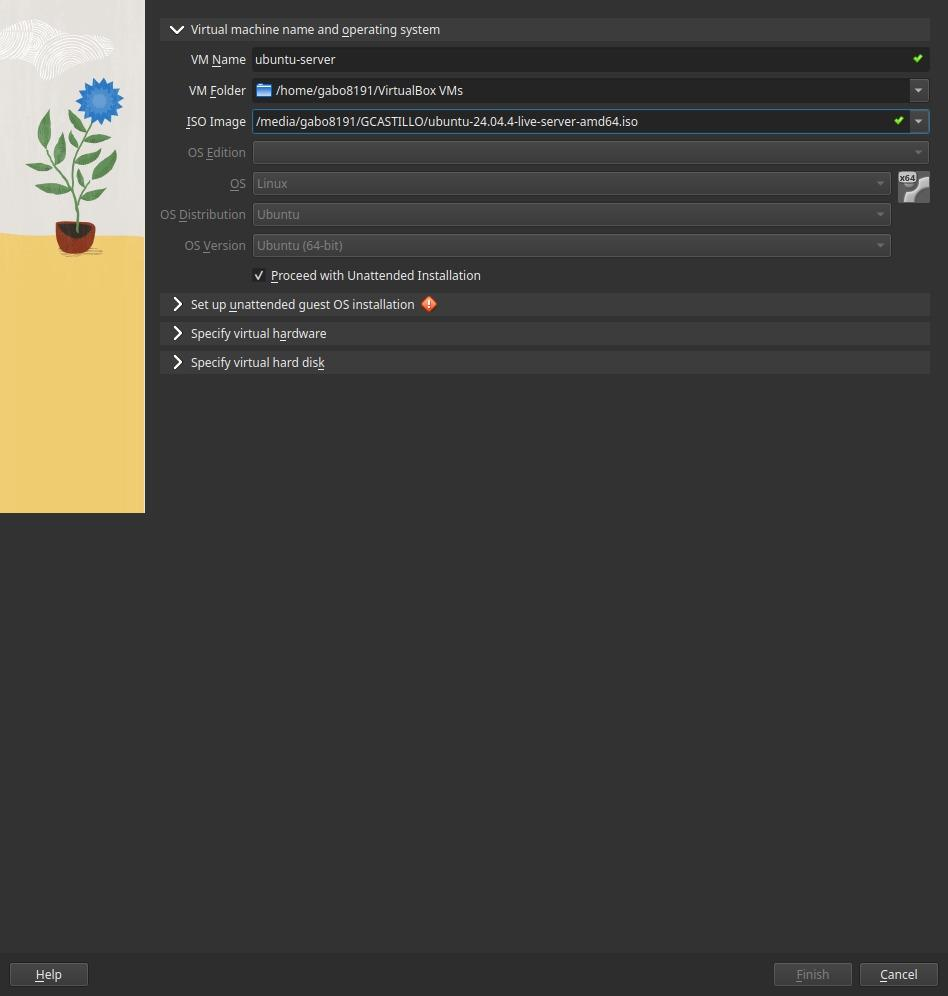

**Figura 22.** Creación de MV en VirtualBox — Nombre `ubuntu-server`, ISO `ubuntu-24.04.4-live-server-amd64.iso`.

</div>

### 8.2. Proceso de instalación de Ubuntu Server

Se ejecutó la instalación de Ubuntu Server dentro de la máquina virtual de VirtualBox, siguiendo el proceso estándar de instalación con Subiquity.

<div align="center">

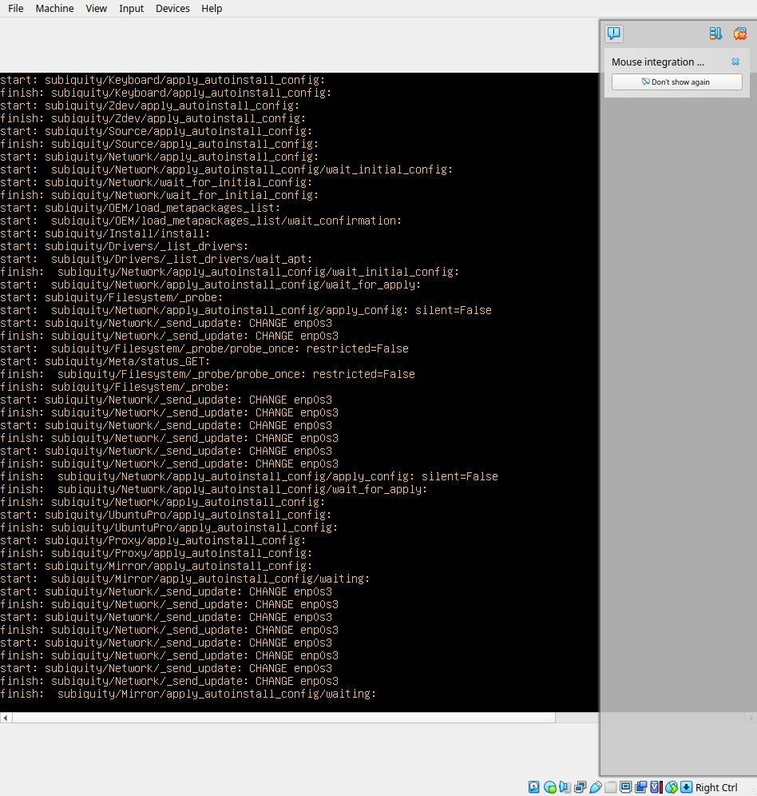

**Figura 23.** Proceso de instalación de Ubuntu Server en VirtualBox — Configuración automatizada de Subiquity.

</div>

### 8.3. Configuración de red (Adaptador puente)

Para que la máquina virtual pudiera comunicarse con las demás MVs en la red, se configuró el adaptador de red como **Adaptador puente** (Bridged Adapter), permitiendo que la MV obtenga una IP en la misma red que el equipo anfitrión.

<div align="center">

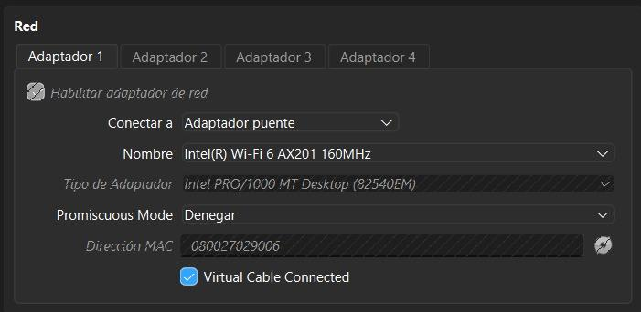

**Figura 24.** Configuración del adaptador puente en VirtualBox — Intel Wi-Fi 6 AX201 como interfaz puente.

</div>

### 8.4. Configuración general de la MV en VirtualBox

La configuración completa de la máquina virtual en VirtualBox incluye los siguientes detalles:

<div align="center">

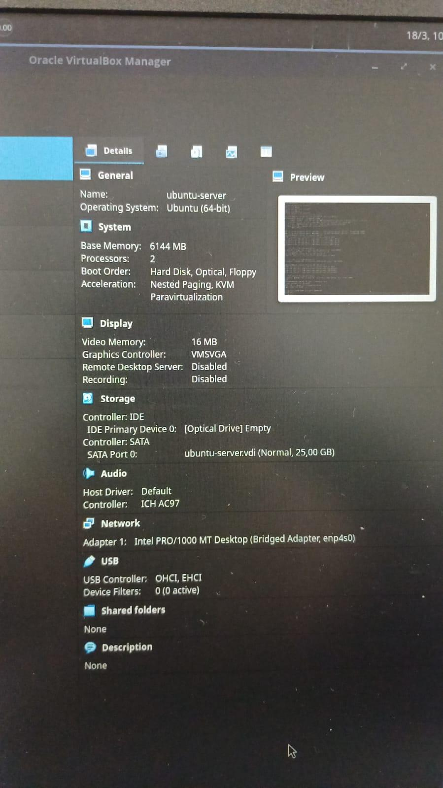

**Figura 25.** Configuración general de la MV `ubuntu-server` en Oracle VirtualBox Manager.

</div>

Los parámetros principales de la MV son:
- **Nombre:** ubuntu-server
- **Sistema operativo:** Ubuntu (64-bit)
- **Memoria base:** 6144 MB
- **Procesadores:** 2
- **Disco duro:** 25 GB (ubuntu-server.vdi)
- **Red:** Intel PRO/1000 MT Desktop (Bridged Adapter)
- **Aceleración:** Nested Paging, KVM Paravirtualization
- **Usuario:** `vboxuser`
- **Contraseña:** `12345678`
- **IP asignada:** 192.168.137.6

### 8.5. Configuración de red estática con Netplan

Por defecto, Ubuntu Server obtiene su dirección IP mediante DHCP. Para asignar una IP estática dentro de la red del proyecto (`192.168.137.0/24`), se modificó la configuración de Netplan.

El archivo de configuración base de Netplan es:

```bash
sudo nano /etc/netplan/00-installer-config.yaml
```

La configuración original (DHCP por defecto) era:

```yaml
network:
  version: 2
  ethernets:
    enp0s3:       # En VirtualBox la interfaz es enp0s3; en el host puede variar (ej. enp4s0)
      dhcp4: true
```

Se modificó para asignar la IP estática `192.168.137.6`, definir el gateway y los servidores DNS, dejando comentada la configuración DHCP original:

```yaml
network:
  version: 2
  ethernets:
    enp0s3:
      # dhcp4: true
      addresses:
        - 192.168.137.6/24
      routes:
        - to: default
          via: 192.168.137.1
      nameservers:
        addresses:
          - 8.8.8.8
          - 8.8.4.4
```

> **Nota:** El nombre de la interfaz de red (`enp0s3`) corresponde al adaptador virtual de VirtualBox. En otros entornos puede variar (por ejemplo `enp4s0` en el equipo anfitrión). Se puede verificar el nombre de la interfaz con el comando `ip a`.

Una vez guardado el archivo, se aplicó la configuración con:

```bash
sudo netplan apply
```

Se verificó que la IP quedara correctamente asignada con:

```bash
ip a
```

### 8.6. Verificación de puertos y servicios

Una vez instalado y configurado Ubuntu Server, se verificó que los servicios necesarios estuvieran escuchando en los puertos correctos.

<div align="center">

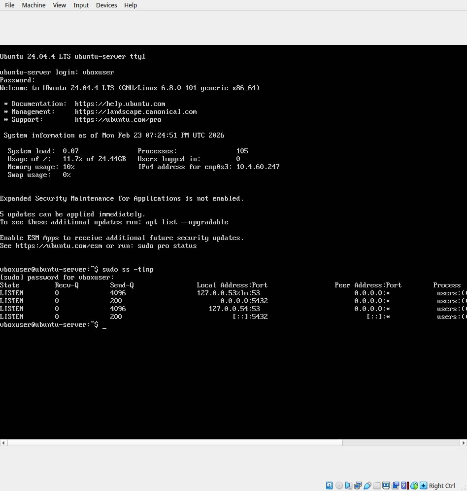

**Figura 26.** Verificación de puertos en escucha — Puerto 5432 (PostgreSQL) y puerto 53 (DNS) activos.

</div>

Se observó mediante el comando `sudo ss -tlnp` que PostgreSQL estaba escuchando en el puerto **5432** en todas las interfaces (`0.0.0.0:5432` y `[::]:5432`), confirmando que la configuración de acceso remoto fue exitosa.

---

## 9. Instalación de servicios en la MV de VirtualBox

### 9.1. Instalación y verificación de PostgreSQL

Se instaló PostgreSQL en la MV de VirtualBox con el mismo comando utilizado en Proxmox:

```bash
sudo apt install postgresql postgresql-contrib -y
```

Se verificó la instalación y el estado del servicio, confirmando que PostgreSQL 16.11 quedó correctamente instalado y activo.

<div align="center">

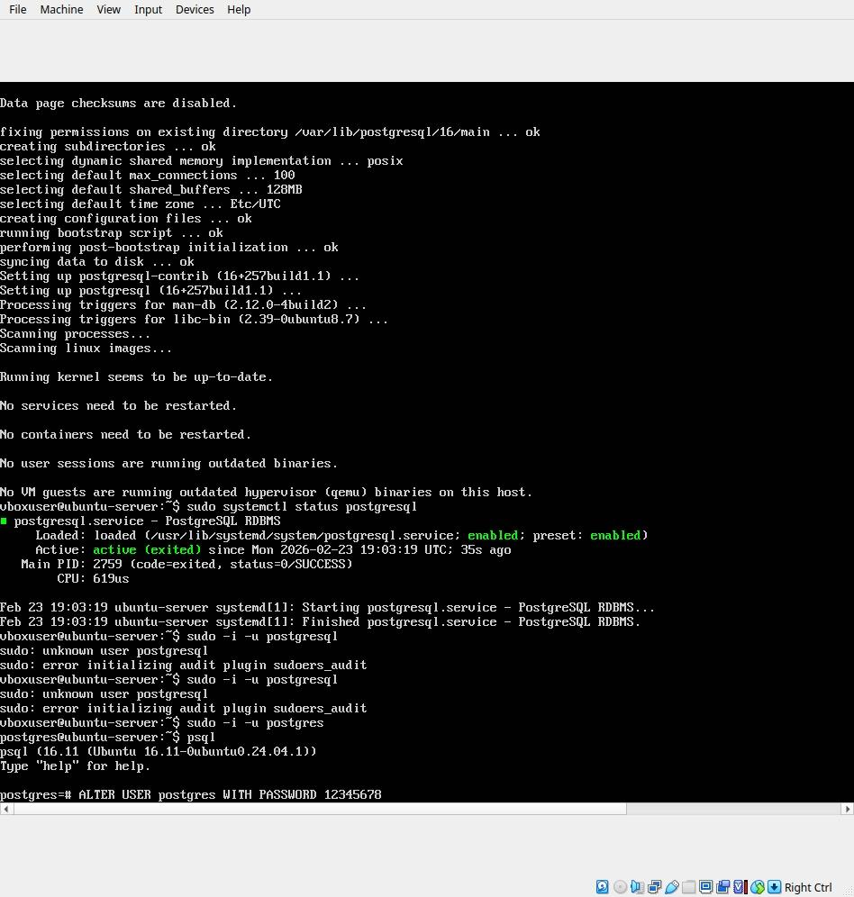

**Figura 27.** Instalación y verificación de PostgreSQL en la MV de VirtualBox — PostgreSQL 16.11 activo.

</div>

### 9.2. Creación de base de datos y usuarios

Se procedió a crear la base de datos y el usuario necesario para las pruebas y la conexión remota.

En la MV de VirtualBox se creó la base de datos `electiva` y el usuario `luis`:

```sql
CREATE DATABASE electiva OWNER postgres;
GRANT ALL PRIVILEGES ON DATABASE electiva TO postgres;
```

<div align="center">

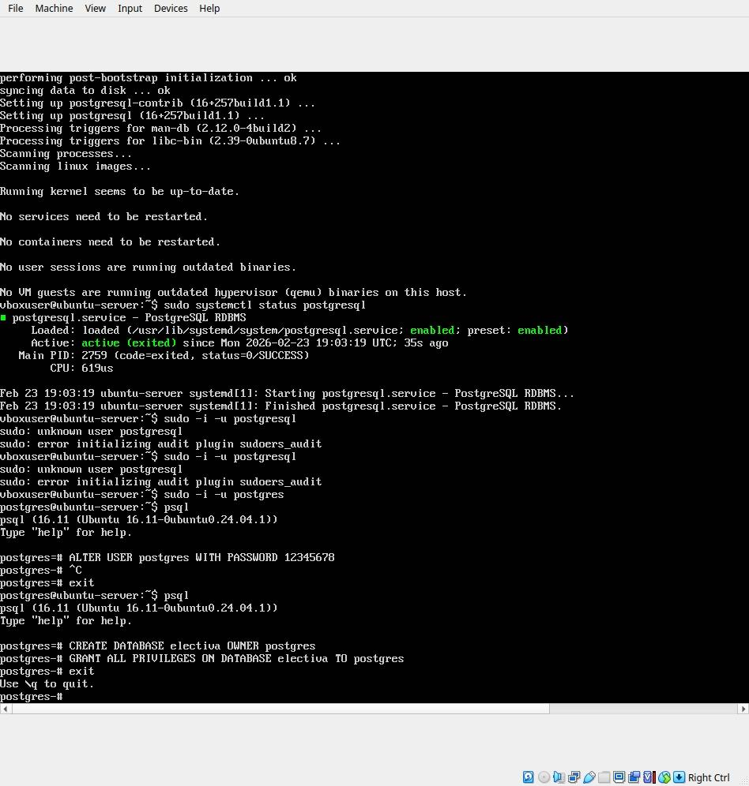

**Figura 28.** Creación de la base de datos `electiva` y asignación de privilegios en VirtualBox.

</div>

Posteriormente se creó el usuario `luis` con contraseña y se le otorgaron todos los privilegios sobre la base de datos:

```sql
CREATE USER luis WITH PASSWORD '12345678';
CREATE DATABASE electiva OWNER luis;
GRANT ALL PRIVILEGES ON DATABASE electiva TO luis;
```

<div align="center">

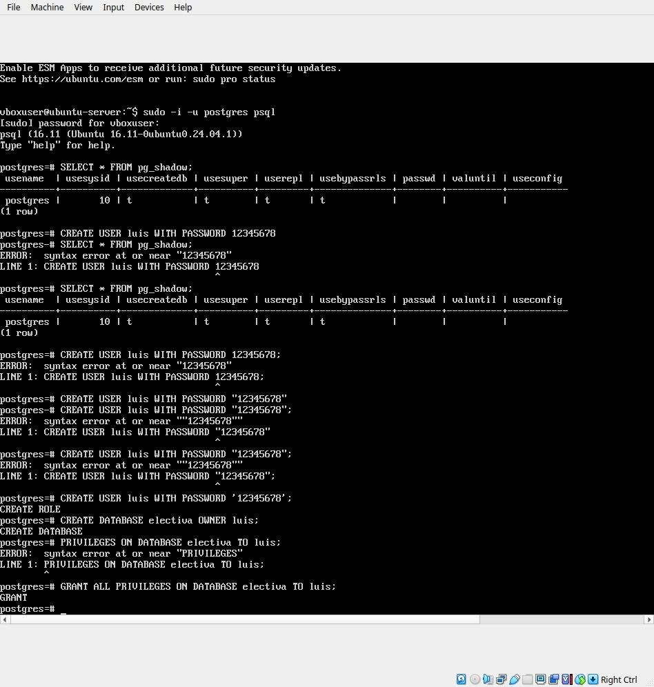

**Figura 29.** Creación del usuario `luis` y asignación de privilegios sobre la base de datos `electiva`.

</div>

### 9.3. Configuración de acceso remoto a PostgreSQL

De manera análoga a la MV de Proxmox, se configuró el acceso remoto a PostgreSQL:

1. **`postgresql.conf`:** Se modificó `listen_addresses = '*'`
2. **`pg_hba.conf`:** Se agregó la regla para la red `192.168.137.0/24`
3. Se reinició el servicio con `sudo systemctl restart postgresql`

---

## 10. Configuración del cliente externo — Fedora Workstation (MV de desarrollo)

La tercera máquina virtual del sistema es una instancia de **Fedora Workstation** que funciona como estación de trabajo de desarrollo. Esta MV se creó en VirtualBox y sirve como cliente para acceder a los servicios de las otras dos máquinas virtuales (servidor web y base de datos).

### 10.1. Configuración de la MV Fedora Workstation

Se creó una MV en VirtualBox con la siguiente configuración:

<div align="center">

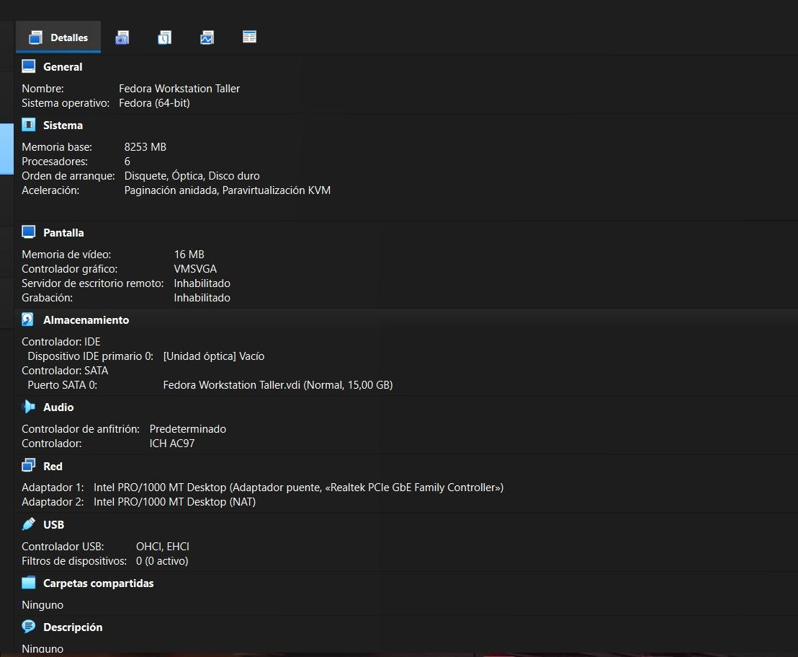

**Figura 34.** Configuración de la MV Fedora Workstation en VirtualBox.

</div>

Los parámetros principales son:
- **Nombre:** Fedora Workstation Taller
- **Sistema operativo:** Fedora (64-bit)
- **Memoria base:** 8253 MB
- **Procesadores:** 6
- **Disco duro:** 15 GB (Fedora Workstation Taller.vdi)
- **Red:** Adaptador 1 — Adaptador puente (Realtek PCIe GbE) + Adaptador 2 — NAT
- **Usuario:** `nico`
- **Contraseña:** `12345678`
- **IP asignada:** 192.168.137.8

### 10.2. Acceso al servidor web Apache desde Fedora

Desde la MV de Fedora Workstation se accedió al servicio de Apache ejecutándose en la MV de Proxmox, ingresando la dirección `http://192.168.137.7` en el navegador web.

<div align="center">

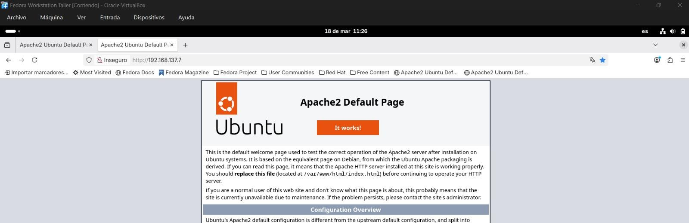

**Figura 35.** Acceso exitoso al servidor Apache desde Fedora Workstation — Página por defecto de Apache2 Ubuntu.

</div>

La página por defecto de Apache2 Ubuntu se mostró correctamente, confirmando la conectividad entre la MV cliente (Fedora) y el servidor web (Proxmox).

### 10.3. Conexión a las bases de datos con DBeaver

Se instaló **DBeaver** en la MV de Fedora Workstation para gestionar las conexiones a las bases de datos PostgreSQL de ambos servidores.

Se configuró la conexión a la base de datos `electiva` en la MV de VirtualBox (host: `192.168.137.6`, usuario: `luis`, contraseña: `12345678`):

<div align="center">

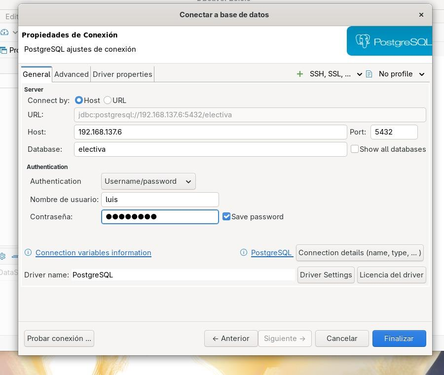

**Figura 36.** Configuración de conexión a PostgreSQL desde DBeaver — Host 192.168.137.6, base de datos `electiva`, usuario `luis`.

</div>

Finalmente, se verificó que ambas conexiones a las bases de datos estuvieran activas y operativas:

- **electiva** → 192.168.137.6:5432 (VirtualBox) — Usuario: `luis`, Contraseña: `12345678`
- **testing** → 192.168.137.7:5432 (Proxmox) — Usuario: `nico`, Contraseña: `12345678`

<div align="center">

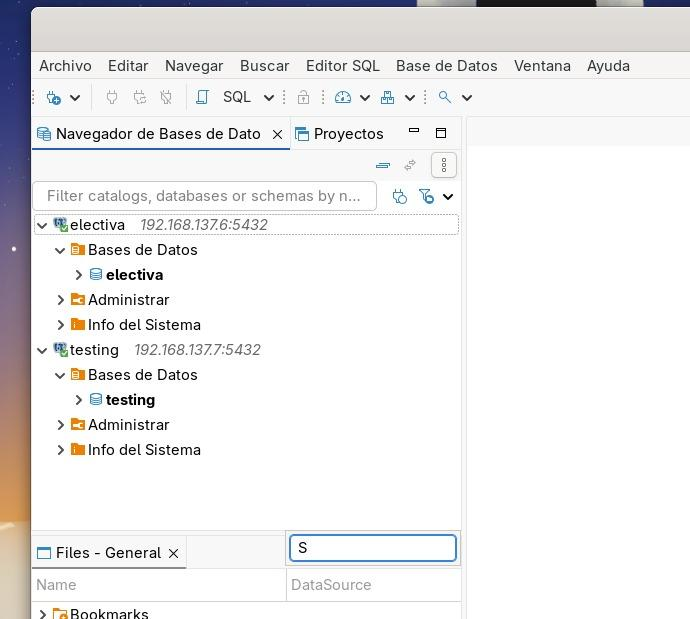

**Figura 37.** Vista del navegador de bases de datos en DBeaver — Ambas conexiones activas (`electiva` y `testing`).

</div>

---

## 11. Pruebas de rendimiento (Benchmarks)

Para evaluar el rendimiento comparativo entre el hipervisor de Tipo 1 (Proxmox) y el hipervisor de Tipo 2 (VirtualBox), se desarrollaron y ejecutaron dos scripts de benchmark en Python:

1. **`benchmark_apache.py`** — Benchmark de servidor web (Apache).
2. **`benchmark_postgresql.py`** — Benchmark de base de datos (PostgreSQL).

### 11.1. Benchmark de Apache (Servidor Web)

El script de benchmark de Apache simula carga HTTP concurrente sobre los servidores web de ambas máquinas virtuales. La configuración utilizada fue:

- **Total de peticiones:** 2,000 por servidor
- **Concurrencia:** 50 hilos simultáneos
- **URLs objetivo:**
  - Proxmox (Tipo 1): `http://192.168.137.7/`
  - VirtualBox (Tipo 2): `http://192.168.137.6/`

El script utiliza `concurrent.futures.ThreadPoolExecutor` para lanzar las peticiones de manera concurrente y mide las siguientes métricas:
- **RPS (Requests Per Second):** Número de solicitudes atendidas por segundo (mayor es mejor).
- **Latencia promedio:** Tiempo promedio de respuesta en segundos (menor es mejor).
- **Errores:** Número de peticiones fallidas.
- **Códigos de estado HTTP:** Distribución de respuestas por código.

### 11.2. Benchmark de PostgreSQL (Base de Datos)

El script de benchmark de PostgreSQL ejecuta una serie de pruebas intensivas directamente sobre las bases de datos de ambos servidores. La configuración utilizada fue:

- **Filas para pruebas de I/O:** 300,000
- **Filas para pruebas de CPU/sort:** 500,000
- **Filas para pruebas matemáticas:** 500,000
- **Filas para pruebas de JOIN:** 5,000 por lado
- **Repeticiones por prueba:** 3

Las pruebas ejecutadas fueron:

| Prueba | Descripción | Métrica principal |
|--------|-------------|-------------------|
| **I/O — Escritura masiva** | INSERT de 300,000 filas con datos aleatorios (UUID, MD5, NUMERIC) | Tiempo en segundos |
| **I/O — Lectura secuencial** | COUNT, AVG y MAX sobre 300,000 filas | Tiempo en segundos |
| **I/O — Creación de índice** | Creación de índice B-tree sobre columna numérica | Tiempo en segundos |
| **I/O — Lectura indexada** | Búsquedas por rango usando el índice (5 rangos) | Tiempo promedio en segundos |
| **CPU — Sort** | Ordenamiento de 500,000 filas generadas aleatoriamente | Tiempo promedio (3 reps) |
| **CPU — Agregaciones** | Cálculo de COUNT, AVG, STDDEV y percentiles (P50, P95, P99) | Tiempo promedio (3 reps) |
| **CPU — Join analítico** | JOIN entre dos conjuntos con agrupación y agregación | Tiempo promedio (3 reps) |
| **CPU — Funciones matemáticas** | Operaciones FPU: sqrt, sin, cos, ln, power sobre 500,000 filas | Tiempo promedio (3 reps) |

<div align="center">

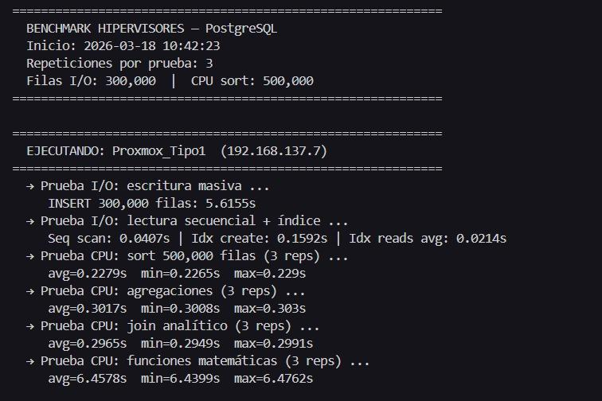

**Figura 30.** Ejecución del benchmark de PostgreSQL sobre la MV de Proxmox (Tipo 1) — IP 192.168.137.7.

</div>

<div align="center">

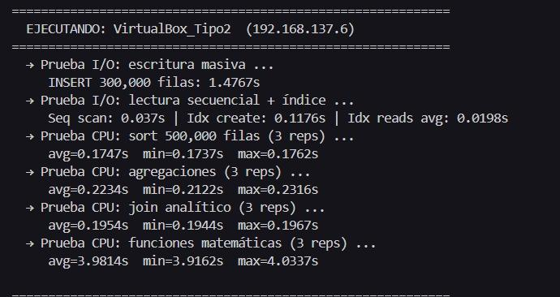

**Figura 31.** Ejecución del benchmark de PostgreSQL sobre la MV de VirtualBox (Tipo 2) — IP 192.168.137.6.

</div>

### 11.3. Resultados del benchmark de Apache

**Tabla 6.** Resultados del benchmark de Apache.

| Métrica | Proxmox (Tipo 1) | VirtualBox (Tipo 2) |
|---------|-------------------|---------------------|
| **Total de peticiones** | 2,000 | 2,000 |
| **Concurrencia** | 50 hilos | 50 hilos |
| **Tiempo total (s)** | 1.8167 | 1.7386 |
| **RPS (Req/s)** | 1,100.88 | 1,150.33 |
| **Latencia promedio (s)** | 0.0406 | 0.0388 |
| **Latencia mínima (s)** | 0.0082 | 0.0095 |
| **Latencia máxima (s)** | 0.0813 | 0.0883 |
| **Desviación estándar** | 0.0101 | 0.0103 |
| **Errores** | 0 | 0 |
| **Código 200** | 2,000 (100%) | 2,000 (100%) |

### 11.4. Resultados del benchmark de PostgreSQL

**Tabla 7.** Resultados del benchmark de PostgreSQL.

| Métrica | Proxmox (Tipo 1) | VirtualBox (Tipo 2) |
|---------|-------------------|---------------------|
| **IO — INSERT 300K filas (s)** | 5.6155 | 1.4767 |
| **IO — Seq scan (s)** | 0.0407 | 0.0370 |
| **IO — Crear índice (s)** | 0.1592 | 0.1176 |
| **IO — Lecturas idx avg (s)** | 0.0214 | 0.0198 |
| **CPU — Sort avg (s)** | 0.2279 | 0.1747 |
| **CPU — Sort min (s)** | 0.2265 | 0.1737 |
| **CPU — Sort max (s)** | 0.2290 | 0.1762 |
| **CPU — Agregaciones avg (s)** | 0.3017 | 0.2234 |
| **CPU — Agregaciones min (s)** | 0.3008 | 0.2122 |
| **CPU — Agregaciones max (s)** | 0.3030 | 0.2316 |
| **CPU — Join avg (s)** | 0.2965 | 0.1954 |
| **CPU — Join min (s)** | 0.2949 | 0.1944 |
| **CPU — Join max (s)** | 0.2991 | 0.1967 |
| **CPU — Math avg (s)** | 6.4578 | 3.9814 |
| **CPU — Math min (s)** | 6.4399 | 3.9162 |
| **CPU — Math max (s)** | 6.4762 | 4.0337 |

### 11.5. Comparativa final de PostgreSQL

<div align="center">

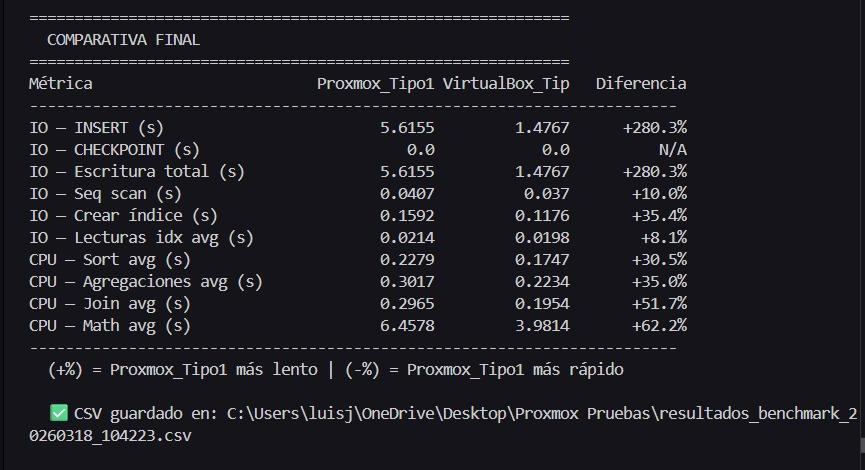

**Figura 32.** Comparativa final del benchmark de PostgreSQL entre Proxmox (Tipo 1) y VirtualBox (Tipo 2).

</div>

**Tabla 8.** Comparativa final de PostgreSQL entre hipervisores.

| Métrica | Proxmox (Tipo 1) | VirtualBox (Tipo 2) | Diferencia |
|---------|-------------------|---------------------|------------|
| IO — INSERT (s) | 5.6155 | 1.4767 | +280.3% |
| IO — Escritura total (s) | 5.6155 | 1.4767 | +280.3% |
| IO — Seq scan (s) | 0.0407 | 0.0370 | +10.0% |
| IO — Crear índice (s) | 0.1592 | 0.1176 | +35.4% |
| IO — Lecturas idx avg (s) | 0.0214 | 0.0198 | +8.1% |
| CPU — Sort avg (s) | 0.2279 | 0.1747 | +30.5% |
| CPU — Agregaciones avg (s) | 0.3017 | 0.2234 | +35.0% |
| CPU — Join avg (s) | 0.2965 | 0.1954 | +51.7% |
| CPU — Math avg (s) | 6.4578 | 3.9814 | +62.2% |

> **(+%) indica que Proxmox Tipo 1 es más lento | (-%) indica que Proxmox Tipo 1 es más rápido.**

### 11.6. Comparativa final de Apache

<div align="center">

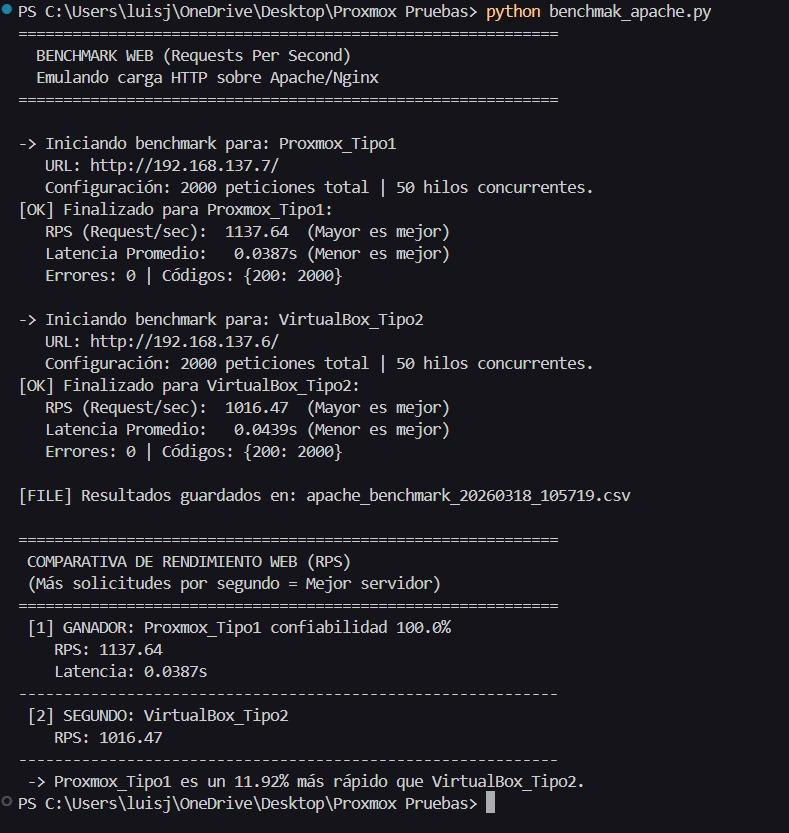

**Figura 33.** Ejecución y comparativa del benchmark de Apache entre ambos hipervisores.

</div>

**Tabla 9.** Comparativa final de Apache entre hipervisores.

| Métrica | Proxmox (Tipo 1) | VirtualBox (Tipo 2) | Observación |
|---------|-------------------|---------------------|-------------|
| **RPS (Req/s)** | 1,100.88 | 1,150.33 | VirtualBox +4.5% más rápido |
| **Latencia promedio (s)** | 0.0406 | 0.0388 | VirtualBox 4.4% menor latencia |
| **Latencia mínima (s)** | 0.0082 | 0.0095 | Proxmox 13.7% menor mínima |
| **Latencia máxima (s)** | 0.0813 | 0.0883 | Proxmox 7.9% menor máxima |
| **Errores** | 0 | 0 | Ambos con 100% de confiabilidad |

---

## 12. Análisis de resultados

Los resultados de los benchmarks muestran que la MV ejecutada sobre **VirtualBox (Tipo 2)** obtuvo un rendimiento superior en prácticamente todas las métricas evaluadas, tanto en las pruebas de Apache como en las de PostgreSQL. Sin embargo, esta diferencia **no se debe al tipo de hipervisor en sí**, sino a las **diferencias significativas en el hardware** de los equipos anfitriones.

### Factor determinante: Diferencia de hardware

Las máquinas virtuales en ambos hipervisores fueron configuradas con **condiciones equivalentes**:
- Mismo sistema operativo: Ubuntu Server 24.04.4 LTS
- Misma cantidad de CPU virtual: 2 cores
- Misma cantidad de RAM: 6 GB
- Mismos servicios instalados: Apache y PostgreSQL

La gran diferencia radica en el hardware subyacente:

**Tabla 10.** Aspectos del hardware anfitrión relevantes para la interpretación de los benchmarks.

| Aspecto | Equipo Proxmox (Tipo 1) | Equipo VirtualBox (Tipo 2) |
|---------|--------------------------|---------------------------|
| **Procesador** | Intel Core i5-3470 (3.ª gen, 2013) | Intel Core i5-12450H (12.ª gen, 2022) |
| **Frecuencia** | 3.20 GHz | 4.40 GHz |
| **Arquitectura** | Ivy Bridge | Alder Lake |
| **IPC (Instructions Per Clock)** | Menor | Significativamente mayor |
| **Almacenamiento** | HDD | SSD NVMe |
| **Generaciones de diferencia** | — | ~9 generaciones más reciente |

### Impacto en las pruebas de PostgreSQL

La diferencia más notable se observó en las pruebas de **I/O — INSERT masivo** (+280.3%), lo cual se explica principalmente por:
- El equipo de Proxmox utiliza un **HDD mecánico**, mientras que el de VirtualBox tiene un **SSD NVMe**, que es órdenes de magnitud más rápido para operaciones de escritura.
- La arquitectura Alder Lake del i5-12450H tiene mejoras sustanciales en la gestión de memoria caché y el pipeline de ejecución.

En las pruebas de **CPU** (Sort, Agregaciones, Join, Math), la diferencia oscila entre +30% y +62%, lo cual corresponde proporcionalmente a la diferencia generacional entre ambos procesadores.

### Impacto en las pruebas de Apache

En las pruebas de Apache la diferencia fue mucho menor (~4.5% en RPS), ya que estas pruebas dependen más del ancho de banda de red y menos de la capacidad de procesamiento puro del CPU. Ambos servidores atendieron las 2,000 peticiones con **0 errores y 100% de confiabilidad**.

### Consideración sobre los tipos de hipervisor

Bajo condiciones de hardware idénticas, se esperaría que el hipervisor de **Tipo 1 (Proxmox/bare-metal) tenga un rendimiento ligeramente superior** al de Tipo 2, ya que:
- Accede directamente al hardware sin la capa intermedia del sistema operativo anfitrión.
- Tiene menor overhead en la gestión de recursos.
- Utiliza paravirtualización KVM de forma nativa.

La ventaja de VirtualBox en estas pruebas es un artefacto de la diferencia de hardware, no una característica inherente del tipo de hipervisor.

---

## 13. Conclusiones

1. **Infraestructura funcional:** Se logró implementar exitosamente una red de tres máquinas virtuales interconectadas, cada una representando un servidor crítico de la empresa ACME, con comunicación plena entre ellas a través de la red `192.168.137.0/24`.

2. **Coexistencia de hipervisores:** Se demostró que es posible integrar un hipervisor de Tipo 1 (Proxmox VE) y uno de Tipo 2 (Oracle VirtualBox) en una misma infraestructura, logrando que las máquinas virtuales gestionadas por hipervisores diferentes se comuniquen entre sí sin inconvenientes.

3. **Servicios operativos:** Los servicios de Apache y PostgreSQL fueron instalados y configurados correctamente en ambas máquinas virtuales, permitiendo el acceso remoto tanto desde el cliente externo (Fedora Workstation) como entre las propias MVs.

4. **Impacto del hardware en el rendimiento:** Los resultados de los benchmarks evidencian que el hardware del equipo anfitrión es el factor determinante en el rendimiento de las máquinas virtuales. La MV de VirtualBox, ejecutada sobre un equipo con procesador Intel Core i5 de 12.ª generación y almacenamiento SSD, superó en rendimiento a la MV de Proxmox ejecutada sobre un equipo con procesador Intel Core i5 de 3.ª generación y almacenamiento HDD, a pesar de que las condiciones de virtualización (CPU, RAM, SO) fueron equivalentes.

5. **Diferencia de rendimiento en PostgreSQL:** La diferencia más significativa se observó en las pruebas de I/O de escritura masiva (+280.3%), explicada principalmente por la diferencia entre HDD y SSD en los equipos anfitriones. Las pruebas de CPU mostraron diferencias entre +30% y +62%, coherentes con la brecha generacional de 9 generaciones entre ambos procesadores.

6. **Rendimiento similar en Apache:** Las pruebas de servidor web mostraron un rendimiento muy similar entre ambos hipervisores (~4.5% de diferencia en RPS), con ambos servidores manteniendo una confiabilidad del 100% y 0 errores en las 2,000 peticiones realizadas.

7. **Validación del concepto:** El proyecto valida que la virtualización, tanto mediante hipervisores de Tipo 1 como de Tipo 2, es una solución viable para la implementación de infraestructura de servidores empresariales, permitiendo la consolidación de servicios, la optimización de recursos de hardware y la flexibilidad en la gestión de la infraestructura TI.

8. **Conectividad verificada desde cliente externo:** La MV de Fedora Workstation logró acceder exitosamente al servidor web Apache (navegador) y a las bases de datos PostgreSQL (DBeaver) de ambos servidores, validando la arquitectura cliente-servidor implementada.
